# Lab 1 -- Setting up the environment

## Objectives

This Lab guides you through the deployment of the Microsoft Sentinel
Training Lab solution that will be used in all subsequent Labs.

# Getting started with the Labs. 

 

1.  Once you have registered and launched the Lab, you will be provided
    a Virtual Machine on the right side of the Screen. 

2.  On the Left side you should have the Lab interface with various
    options to operate the Lab interface. 

3.  The Credentials to login to the VM would be provided on the home tab
    in the Lab interface toolbar, as shown in the below image. 

> 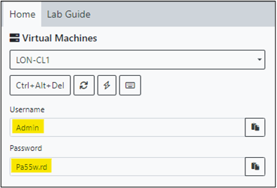{width="3.9551662292213474in"
> height="2.5791666666666666in"} 

4.  You should also have the Office 365 Tenant Credentials provided in
    the Lab interface toolbar. 

> 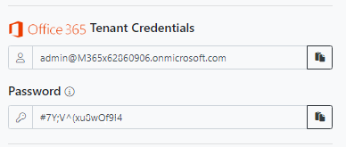{width="4.040277777777778in"
> height="1.7201388888888889in"} 

5.  Additional buttons for the tools are available on the toolbar to
    make the VM and interface utilize the Fullscreen, take a screenshot,
    paste any copied text into the VM and Exit the Lab to save or end
    the Lab. 

> {width="3.4402777777777778in"
> height="3.1597222222222223in"} 

6.  Login to the Lab VM using the credential provided. 

> {width="6.268055555555556in"
> height="3.8930555555555557in"} 

# Exercise 1 - Prepare the Environment

## Task 1: Redeem Azure pass

1.  Login to the LON-CL1 VM using the credentials provided on the Home
    tab of the Lab interface.

    {width="3.9551662292213474in"
    height="2.5791666666666666in"}

2.  In your lab VM, open Microsoft Edge browser and open the following
    link:
    [**http://www.microsoftazurepass.com**](urn:gd:lg:a:send-vm-keys)

3.  On **Ready to get started?** page, click on the **Start** button.

    {width="5.3446434820647415in"
    height="4.566929133858268in"}

    **Note**: Do not use your Company/Work Account to login to redeem
    the Azure Pass, another Azure Pass will not be issued.

4.  Enter the **Office 365 Tenant credentials** id-
    <admin@M365xxxx.onmicrosoft.com> and click on the **Next** button.

    {width="4.106944444444444in"
    height="3.2263888888888888in"}

5.  Enter the **Office 365 Tenant Password** and click on the **Sign
    in** button.

    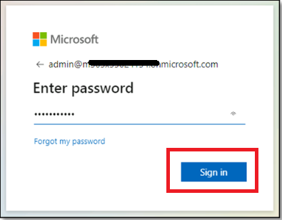{width="4.11875in"
    height="3.2020833333333334in"}

6.  In the **Stayed signed in?** page, click on the **Yes** button.

7.  On **The following Microsoft Account will be used for Azure pass**
    page, click on **Confirm Microsoft Account** button.

    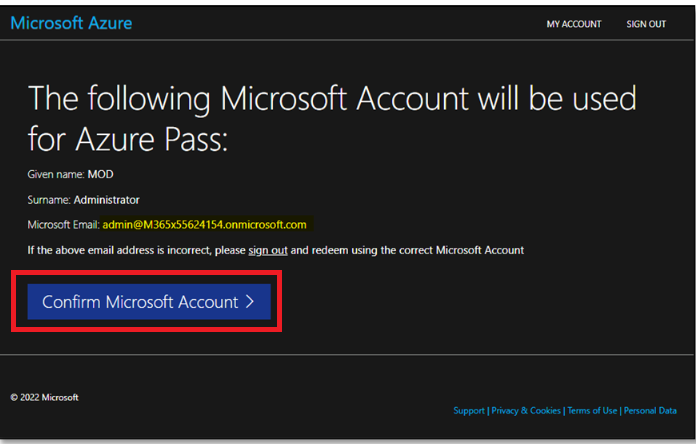{width="5.15239501312336in"
    height="3.2841010498687666in"}

8.  Enter the Promocode provided in the lab environment in the **Enter
    Promo code** field, then enter the characters under the **Enter the
    characters you see** field and click on the **Submit** button.

    {width="6.238564085739283in"
    height="4.069444444444445in"}

9.  **We are processing your request** page will appear, it may take few
    seconds to process the redemption.

    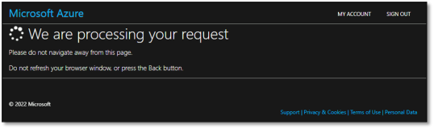{width="5.094488188976378in"
    height="1.5150896762904638in"}

10. Enter the correct details in **Your Profile** page, tick all the
    check boxes, and then click on **Sign up** button.

    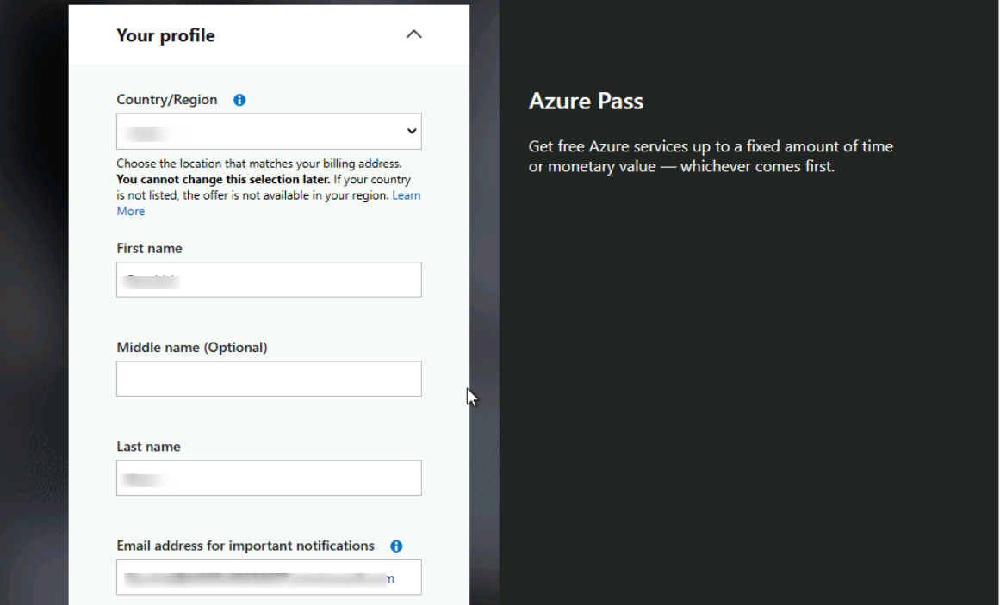{width="6.268055555555556in"
    height="3.795138888888889in"}

    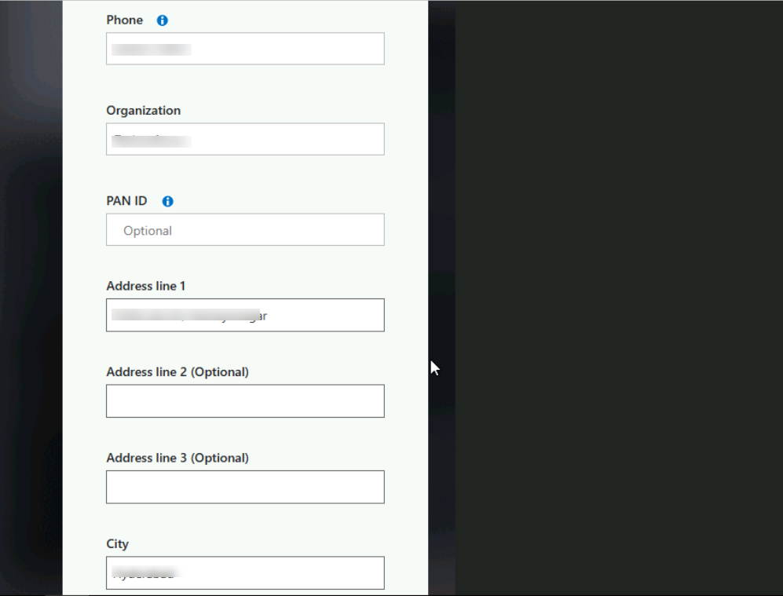{width="6.268055555555556in"
    height="4.771527777777778in"}

    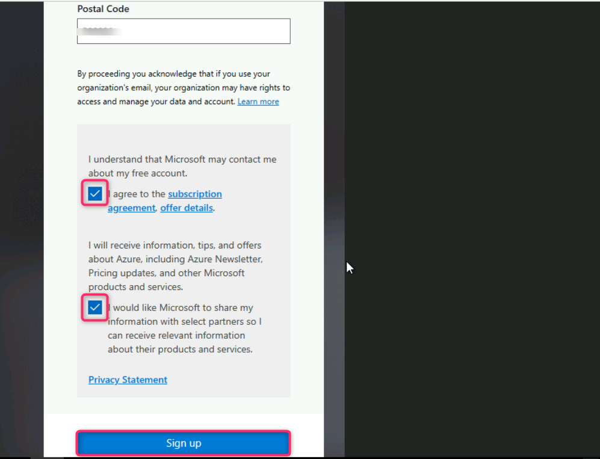{width="6.268055555555556in"
    height="4.7965277777777775in"}

11. On **Are you satisfied with your signup experience** window, enter
    your feedback and click on the **Submit** button.

    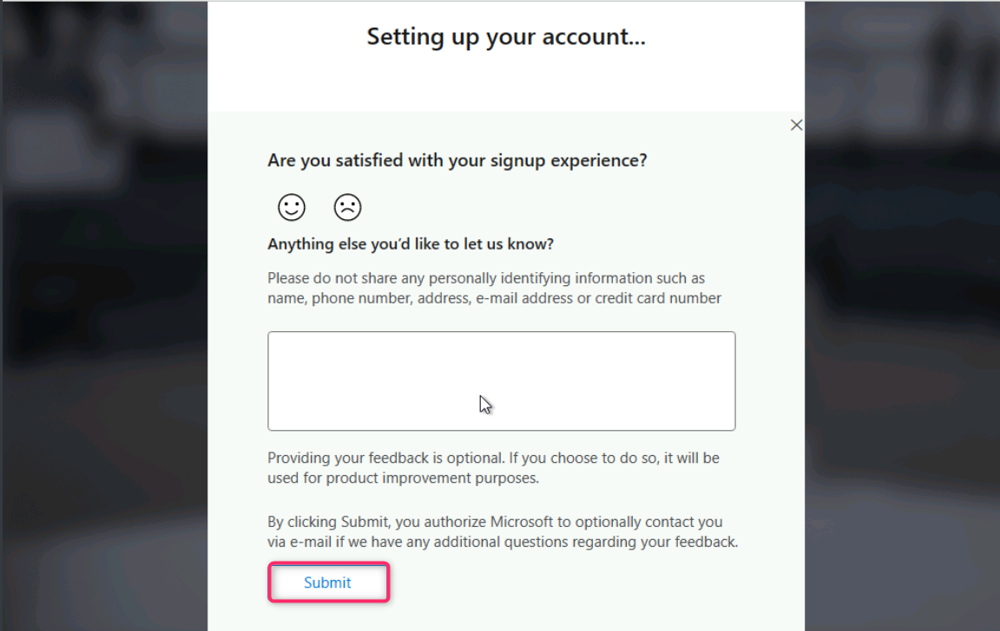{width="6.268055555555556in"
    height="3.9611111111111112in"}

12. It would automatically redirect you to the Azure Portal and now you
    are ready to use Azure services. On **Welcome to Microsoft Azure**
    dialog box, click on the **Maybe later** button.

    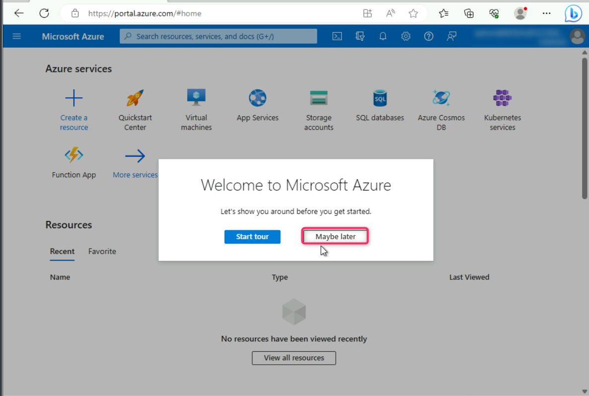{width="6.268055555555556in"
    height="4.217361111111111in"}

## Exercise 2: The Microsoft Sentinel workspace

In this exercise we will see how to create a brand new Microsoft
Sentinel workspace.

1.  Navigate to the **http://portal.azure.com** and log in with the
    **MOD Administrator** credentials provided on the home tab of your
    lab environment.

&nbsp;

1.  In the top search bar, type **Microsoft Sentinel** and click on
    **Microsoft Sentinel**.

{width="6.268055555555556in"
height="4.002777777777778in"}

2.  In the **Microsoft Sentinel** screen, click **Create** at the top
    left.

{width="6.268055555555556in"
height="4.788465660542432in"}

3.  You can choose to add **Microsoft Sentinel** to an existing **Log
    Analytics** **workspace** or build a new one. We will create a new
    one, so click on **Create a new workspace**.

{width="6.268055555555556in"
height="4.729166666666667in"}

4.  In the Create Log Analytics workspace page, fill out the form as
    follows:

-   Subscription: **Azure Pass - Sponsorship**

-   Resource Group: click on **Create new** **LAWResourceGroup**

-   Region: **East US**

-   Workspace Name: **MicrosoftSentinelWorkspace**

-   Click **Review + create**.

{width="6.268055555555556in"
height="5.73125in"}

5.  Click **Create** after the validation completes. The creation takes
    a few seconds.

{width="6.268055555555556in"
height="5.717361111111111in"}

6.  You will be redirected back to the **Add Microsoft Sentinel** to a
    workspace page, click on the **Refresh** button.

{width="6.268055555555556in"
height="4.476388888888889in"}

7.  Select your workspace and click **Add** at the bottom.

{width="6.268055555555556in"
height="3.6333333333333333in"}

8.  You should receive notification as shown in below image

    {width="2.7608016185476814in"
    height="0.739686132983377in"}

    {width="3.4588156167979003in"
    height="1.0105577427821522in"}

9.  Your Microsoft Sentinel workspace is now ready to use!

    {width="6.268055555555556in"
    height="3.972916666666667in"}

## Exercise 3: Deploy the Microsoft Sentinel Training Lab Solution

In this exercise you will deploy the Training Lab solution into your
existing workspace. This will ingest pre-recorded data (\~20 MBs) and
create several other artifacts that will be used during the exercises.

1.  In the Azure Portal (**http://portal.azure.com**), go to the top
    search bar and type **Microsoft Sentinel Training**. Select the
    **Microsoft Sentinel Training Lab Solution (Preview)**, a
    Marketplace item.

{width="6.268055555555556in"
height="4.113194444444445in"}

10. Read the solution description and click **Create** at the top.

{width="6.268055555555556in"
height="3.472916666666667in"}

11. In the **Basics** tab, select **Azure pass - Sponsorship** as the
    **Subscription**, **LAWResourceGroup** as the **Resource Group** and
    **MicrosoftSentinelWorkspace** as the **Workspace**.

{width="6.268055555555556in"
height="5.013194444444444in"}

12. Optionally, review the different tabs (**Workbooks**, **Analytics**,
    **Hunting Queries**, **Watchlists**, **Playbooks**) in the solution.
    When ready, click on **Review + create**.

13. Once validation is ok, click on **Create**. The deployment process
    takes about 15 minutes.

{width="6.268055555555556in"
height="4.998611111111111in"}

[**Note** -- The deployment will take up to 15 minutes to
complete.]{.mark}

14. You can proceed ahead with the next exercise while the deployment is
    in progress.

    {width="6.268055555555556in"
    height="3.4319444444444445in"}

## Exercise 4: Deploy a template for creating a Watchlist

1.  In the new tab navigate to the Azure Portal
    [**http://portal.azure.com**](http://portal.azure.com) and search
    for and select **Deploy a custom template**.

{width="6.268055555555556in"
height="3.363888888888889in"}

2.  Select **Build your own template in editor**.

{width="6.268055555555556in"
height="4.066666666666666in"}

3.  Go to **C:\\Labfiles** \> **Lab1_watchlist.txt** and copy the json
    code. Paste it in the editor and select **Save**.

{width="6.268055555555556in"
height="3.55625in"}

4.  Fill in the following details and select **Review + create**.

-   Subscription -- **Azure Pass - Sponsorship**

-   Resource group -- **LAWResourceGroup**

-   Region -- **East US**

-   Workspace Name -- **MicrosoftSentinelWorkspace**

{width="6.268055555555556in"
height="4.9625in"}

5.  Click on the **Create** button.

{width="6.268055555555556in"
height="5.065277777777778in"}

6.  The deployment should be completed in few seconds.

{width="6.268055555555556in"
height="2.79375in"}

## Exercise 5: Create a custom Playbook

In this exercise, we will create a Playbook that will be later used in
the lab.

1.  From the Azure Portal **<http://portal.azure.com>** search bar, type
    **Microsoft Sentinel** and click on **Microsoft Sentinel**.

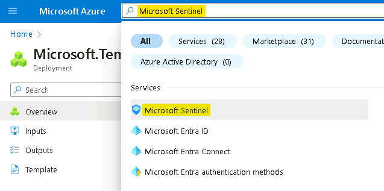{width="6.268055555555556in" height="3.11875in"}

15. Select **MicrosoftSentinelWorkspace**.

{width="6.268055555555556in"
height="2.5055555555555555in"}

16. From the **Microsoft Sentinel** navigation menu, go to **settings**.
    Select the **Settings** tab at the top of the page.

{width="6.268055555555556in"
height="5.685416666666667in"}

17. Scroll down and under **Playbook permissions**, select **Configure
    permissions**.

{width="6.268055555555556in"
height="2.9409722222222223in"}

18. Select **LawResourcegroup** and select **Apply**.

{width="6.268055555555556in"
height="4.376388888888889in"}

19. You will see a message that you **Finished adding permissions**.

{width="6.268055555555556in"
height="3.2472222222222222in"}

20. From the **Microsoft Sentinel** navigation menu, select
    **Automation**.

{width="6.268055555555556in"
height="4.176388888888889in"}

21. From the top menu, select **Create** \> **Playbook with incident
    trigger**.

{width="5.646621828521435in"
height="3.9276312335958004in"}

22. Add the following details and click on **Next : Connections**.

-   Subscription -- **Azure Pass - Sponsorship**

-   Resource group -- **LAWResourcegroup**

-   Playbook name -- **customplaybook**

-   Check the box near Enable diagnostics logs in log analytics.

{width="6.268055555555556in"
height="6.042361111111111in"}

23. Click on **Next: Review and create**.

{width="6.268055555555556in"
height="4.165277777777778in"}

24. Then select **Create and continue to designer**.

{width="5.584113079615048in"
height="5.37575021872266in"}

25. In the logic app designer, select **+ New step**.

{width="6.268055555555556in"
height="3.1125in"}

26. Search for **Add comment to incident (V3)** and select [**Add
    comment to incident (V3) (Preview)**](urn:gd:lg:a:send-vm-keys).

{width="6.268055555555556in"
height="4.625in"}

27. In the Incident ARM ID, select **Add dynamic content** and click on
    **Incident ARM ID**.

{width="6.268055555555556in"
height="2.8680555555555554in"}

28. In the comment section type -- **This comment marks the successful
    run of our custom playbook**.

29. If you do not see the step Connected to
    **azuresentinel-customplaybook** select **Change Connection**.

{width="6.268055555555556in"
height="3.6368055555555556in"}

30. Select **azuresentinel-customplaybook**.

{width="6.268055555555556in"
height="3.55625in"}

31. Click **Save**.

{width="6.268055555555556in"
height="3.4159722222222224in"}

Congratulations! You successfully created a playbook that adds the
comment to any incidents. You can modify the steps according to your
need in the flow designer to create custom automation flow.

## Exercise 6: Configure Microsoft Sentinel Playbook

In this exercise, we will configure a Playbook that will be later used
in the lab. This will allow the playbook to access Sentinel.

1.  From the Azure Portal **<http://portal.azure.com>** click on the
    Portal menu and select **Resource Groups**.

{width="3.969304461942257in"
height="3.1150185914260717in"}

2.  Select **LAWResourceGroup**.

{width="5.677876202974629in"
height="2.635784120734908in"}

32. In the resource group you should see an API Connection resource
    called **azuresentinel-Get-GeoFromIpAndTagIncident**, click on it.

{width="6.268055555555556in"
height="3.2020833333333334in"}

33. Click on **Edit API connection** under **General**.

{width="6.268055555555556in"
height="3.1152777777777776in"}

34. Click on **Authorize** and a new window will open to choose an
    account.

{width="6.268055555555556in"
height="3.55625in"}

35. Select the **MOD Administrator** account that you are logged in
    with. If prompted to sign in, sign in with the credentials given on
    the **home** tab of your lab.

{width="6.268055555555556in"
height="3.55625in"}

36. Click **Save** once the authorization is successful.

{width="6.172005686789151in"
height="3.862283464566929in"}

37. You should receive notification as shown in below image

    {width="3.542160979877515in"
    height="0.739686132983377in"}

Congratulations, you have completed Lab 1!
