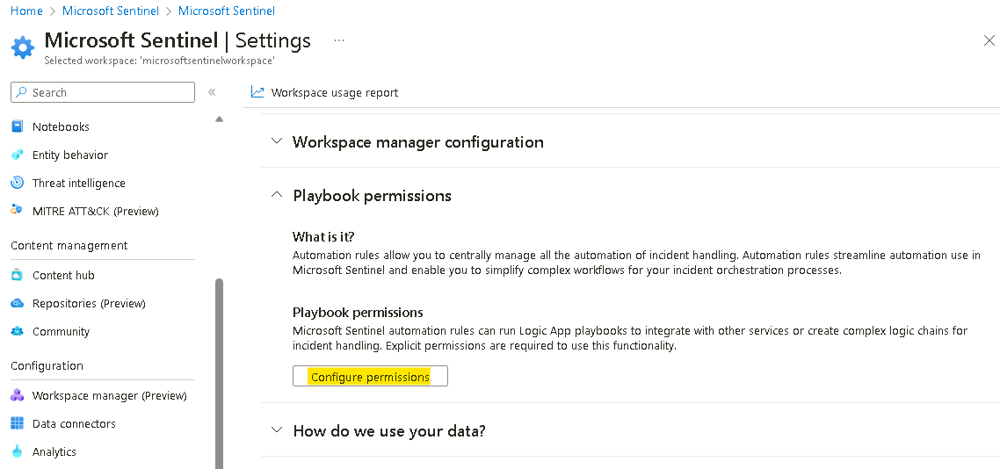

**Lab 1 - Microsoft Sentinel Deployment**

**Objectives**

This Lab guides you through the deployment of the Microsoft Sentinel
solutions that will be used in all subsequent Labs.

**Microsoft Sentinel All-in-One** is aimed at helping customers and
partners quickly set up a full-fledged Microsoft Sentinel environment
that is ready to use, speeding up deployment and initial configuration
tasks in few clicks, saving time and simplifying Microsoft Sentinel
setup.

**Exercise 1 - Setting up the environment and Deploying Microsoft
Sentinel All In One**

**Time - 50 minutes**

**Task 1: Redeeming the Azure pass**

1.  Login to the MS-900-CL1 VM using the credentials provided on the
    Resources tab of the Lab interface.

2.  In your lab VM, open Microsoft Edge browser and open the following
    link: **http://www.microsoftazurepass.com**

3.  On **Ready to get started?** page, click on the **Start** button.

{width="6.268055555555556in"
height="5.355555555555555in"}

4.  Enter your Personal Outlook account details to redeem the provided
    azure pass.

{width="6.268055555555556in"
height="4.933333333333334in"}

**Note:** Please ensure to use an account that was not previously used
to Redeem an Azure Pass It is advisable to create a fresh test outlook
account to use for the lab.

5.  Click on the **Next** button on the **More information
    required** prompt.

{width="6.268055555555556in"
height="6.302083333333333in"}

6.  Provide the credentials and then complete the MFA sign in

{width="6.268055555555556in"
height="3.691666666666667in"}

{width="6.268055555555556in"
height="3.1041666666666665in"}

7.  Once the authentication is completed you will be redirected to the
    Azure Pass redemption page.

8.  In the **Stayed signed in?** page, click on the **Yes** button.

9.  On **The following Microsoft Account will be used for Azure
    pass** page, click on **Confirm Microsoft Account** button.

{width="6.268055555555556in"
height="4.010416666666667in"}

10. Enter the Promocode provided in the lab environment in the **Enter
    Promo code** field, then enter the characters under the **Enter the
    characters you see** field and click on the **Submit** button.

{width="6.268055555555556in"
height="4.094444444444444in"}

11. **We are processing your request** page will appear, it may take few
    seconds to process the redemption.

{width="6.268055555555556in"
height="1.882638888888889in"}

12. Enter the correct details in **Your Profile** page, tick all the
    check boxes, and then click on **Sign up** button.

{width="6.268055555555556in"
height="3.8069444444444445in"}

{width="6.268055555555556in"
height="4.780555555555556in"}

{width="6.268055555555556in"
height="4.798611111111111in"}

13. On **Are you satisfied with your signup experience** window, enter
    your feedback and click on the **Submit** button.

{width="6.268055555555556in"
height="3.970833333333333in"}

14. It would automatically redirect you to the Azure Portal and now you
    are ready to use Azure services. On **Welcome to Microsoft
    Azure** dialog box, click on the **Maybe later** button.

{width="6.268055555555556in"
height="4.231944444444444in"}

**Task 2 \-- Configure Permissions on the Subscription**

1.  In the **Azure Portal** **https://portal.azure.com** search box
    type **subscriptions** and then click **on Subscriptions**.

{width="6.268055555555556in"
height="3.4229166666666666in"}

2.  From the list of Subscriptions select the **Azure Pass \--
    Sponsorship**.

{width="6.268055555555556in"
height="2.545138888888889in"}

3.  On the Azure Pass \-- Sponsorship page click on **Access control
    (IAM)**, then click on **+ Add** drop-down and select **Add role
    assignment**.

{width="6.268055555555556in"
height="4.347222222222222in"}

4.  On the Add role assignment page, under the **Privileged
    administrator roles** tab select **Contributor** and then click
    on **Next**.

{width="6.268055555555556in"
height="4.249305555555556in"}

5.  On the **Members** tab, click on **+ Select members**, then
    choose **your outlook account** and then click on
    the **Select** button.

{width="6.268055555555556in"
height="3.713888888888889in"}

6.  Click on **Review + assign** button.

{width="6.268055555555556in"
height="5.165972222222222in"}

7.  Click on **Review + assign** button again.

{width="6.268055555555556in"
height="4.5993055555555555in"}

8.  You should get the notification as shown in below image.

{width="6.208333333333333in"
height="3.2847222222222223in"}

9.  Click on the Role assignments tab to view the role assigned in the
    previous step. We can see the Users listed to whom
    the Contributor role was assigned.

{width="6.268055555555556in"
height="3.475in"}

**Task 3 \-- Registering required Resource providers**

1.  While still on the Subscription page, from the left menu, click on
    the **Resource Providers** under Settings.

{width="6.268055555555556in"
height="4.454166666666667in"}

2.  In the search bar, type **Microsoft.insight**,
    select **Microsoft.insight** from the list below and click on
    Register.

{width="6.268055555555556in"
height="2.811111111111111in"}

3.  A notification stating Successfully registered resource provider is
    obtained once the registration is successful.

{width="4.673611111111111in"
height="2.1458333333333335in"}

4.  Repeat the steps to register the following Resource providers.

    -   **Microsoft.web**

    -   **Microsoft.SecurityInsights**

    -   **Microsoft.Logic**

{width="6.268055555555556in"
height="3.279861111111111in"}

**Task 4 - Security Admin role to be added to Tenant Administrator
account**

1.  In the browser tab navigate
    to **https://portal.azure.com/#view/Microsoft_AAD_UsersAndTenants/UserManagementMenuBlade/\~/AllUsers** and
    select **your outlook account**

{width="6.268055555555556in"
height="2.51875in"}

2.  Select the **Assigned roles** under Manage and then click on **+ Add
    assignments.**

{width="6.268055555555556in"
height="3.2006944444444443in"}

3.  Search and select **Security Administrator**, then click on
    the **Add** button.

{width="6.268055555555556in"
height="4.864583333333333in"}

{width="5.458333333333333in"
height="0.9027777777777778in"}

**Task 5 - Enabling the trial for Microsoft Defender for cloud**

1.  On the Azure Portal click on **portal menu** and **select Microsoft
    Defender for Cloud.**

{width="2.926388888888889in"
height="9.693055555555556in"}

2.  Click on **Getting started** page from the left pane, On
    the **Upgrade** Tab, select subscription (Azure Pass \--
    Sponsorship) and press Upgrade.

{width="6.268055555555556in"
height="3.5854166666666667in"}

**Note**: You may need to wait for a few minutes for the upgrade to
complete.

{width="5.041666666666667in"
height="1.1180555555555556in"}

3.  Refresh the page and then click on the **Getting started**, then
    click on **Install agents** tab, then select the **Azure
    Subscription** and click\*\* Install agents\*\* to install agents to
    the resources in the subscription.

{width="6.268055555555556in"
height="3.58125in"}

**Note:** You should get the notification as shown in below image
\"Agents installation initiated\"

{width="6.243055555555555in"
height="1.8958333333333333in"}

**Task 6 \-- Deploy the Microsoft Sentinel.**

In this task we will see how to create a brand-new Microsoft Sentinel
workspace.

Navigate to the **http://portal.azure.com** and log in with the **MOD
Administrator** credentials provided on the home tab of your lab
environment.

In the top search bar, type **Microsoft Sentinel** and click on
**Microsoft Sentinel**.

{width="6.270833333333333in"
height="4.0in"}

In the **Microsoft Sentinel** screen, click **Create** at the top left.

{width="6.270833333333333in"
height="4.791666666666667in"}

You can choose to add **Microsoft Sentinel** to an existing **Log
Analytics** **workspace** or build a new one. We will create a new one,
so click on **Create a new workspace**.

{width="6.270833333333333in"
height="4.729166666666667in"}

In the Create Log Analytics workspace page, fill out the form as
follows:

-   Subscription: **Azure Pass - Sponsorship**

-   Resource Group: click on **Create new**

-   Resource group name: !!**RG4Sentinel!!**

-   Region: **East US**

-   Workspace Name: !!**SwrkXXXXXXX!! \[Substitute XXXXXXX with number
    from you Tenant name\]**

-   Click **Review + create**.

{width="6.5in" height="4.845138888888889in"}

Click **Create** after the validation completes. The creation takes a
few seconds.

{width="5.88935476815398in"
height="5.17012467191601in"}

You will be redirected back to the **Add Microsoft Sentinel** to a
workspace page, click on the **Refresh** button.

{width="6.270833333333333in"
height="4.479166666666667in"}

Select your workspace and click **Add** at the bottom.

{width="6.5in" height="5.002083333333333in"}

You should receive notification as shown in below image

{width="2.595485564304462in"
height="3.460647419072616in"}

Your Microsoft Sentinel workspace is now ready to use!

{width="6.5in"
height="2.7506944444444446in"}

**Task 7: Deploy the Microsoft Sentinel Training Lab Solution**

In this exercise you will deploy the Training Lab solution into your
existing workspace. This will ingest pre-recorded data (\~20 MBs) and
create several other artifacts that will be used during the exercises.

In the Azure Portal (**http://portal.azure.com**), go to the top search
bar and type **Microsoft Sentinel Training**. Select the **Microsoft
Sentinel Training Lab Solution (Preview)**, a Marketplace item.

{width="6.270833333333333in"
height="4.114583333333333in"}

Read the solution description and click **Create** at the top.

{width="6.270833333333333in"
height="3.46875in"}

In the **Basics** tab, select **Azure pass - Sponsorship** as the
**Subscription**, **RG4Sentinel** as the **Resource Group** and
[**SwrkXXXXXXX**](urn:gd:lg:a:send-vm-keys)  as the **Workspace**.

{width="6.389689413823272in"
height="5.128429571303587in"}

Optionally, review the different tabs (**Workbooks**, **Analytics**,
**Hunting Queries**, **Watchlists**, **Playbooks**) in the solution.
When ready, click on **Review + create**.

Once validation is ok, click on **Create**. The deployment process takes
about 15 minutes.

{width="6.275029527559055in"
height="5.149277121609798in"}

**Note** -- The deployment will take up to 15 minutes to complete.

You can proceed ahead with the next exercise while the deployment is in
progress.

{width="6.5in"
height="4.807638888888889in"}

{width="6.5in"
height="3.332638888888889in"}

**Task 8 \-- Explore the Microsoft Sentinel dashboard**

1.  In the top search bar, type Microsoft Sentinel and click on
    Microsoft Sentinel.

{width="6.268055555555556in"
height="3.3333333333333335in"}

2.  On the Microsoft Sentinel screen, select the Log analytic workspace
    created during the deployment.

{width="6.268055555555556in"
height="2.4833333333333334in"}

3.  The **Overview (Preview)** page provides the Dashboard display
    details for the below.

i. **Incidents**

ii. **Automation**

iii. **Data**

iv. **Analytics.**

{width="6.268055555555556in"
height="3.204861111111111in"}

4.  Incidents details will populate once the incidents occur in the
    environment.

{width="6.268055555555556in"
height="2.7756944444444445in"}

5.  The Automation rules that are create will appear under the
    Automation dashboard.

{width="6.268055555555556in"
height="3.213888888888889in"}

6.  The Data dashboard will display the Connector health and Data
    received

{width="6.268055555555556in"
height="3.191666666666667in"}

7.  The Analytics dashboard will display the details of Analytics rules.

{width="6.268055555555556in"
height="3.2006944444444443in"}

**Task 10 -- Configure Microsoft Sentinel Playbook**

In this task, we will create a Playbook that will be later used in the
lab.

1.  Open a new tab and browse to the Resource group page
    - https://portal.azure.com/#view/HubsExtension/BrowseResourceGroups

2.  Click on the Resource group **RG4Sentinel**.

{width="6.268055555555556in"
height="2.497916666666667in"}

3.  Click on **Access control (IAM)**, then click on **+ Add** drop-down
    and select **Add role assignment**.

{width="6.268055555555556in"
height="3.573611111111111in"}

4.  On the Add role assignment page, under the **Privileged
    administrator roles** tab select **Owner** and then click
    on **Next**.

{width="6.268055555555556in"
height="3.9194444444444443in"}

5.  On the **Members** tab, click on **+ Select members**, then
    choose **your outlook account** and then click on
    the **Select** button.

{width="6.268055555555556in"
height="4.069444444444445in"}

6.  Click on the **Next** button.

7.  On the Conditions tab, click on the **Allow user to assign all roles
    (highly privileged)** radio button and click on **Review + assign**.

{width="6.268055555555556in"
height="4.060416666666667in"}

8.  On the **Review + assign** tab, click on the **Review +
    assign** button.

{width="6.268055555555556in" height="5.175in"}

{width="5.777777777777778in"
height="1.5069444444444444in"}

9.  From the **Microsoft Sentinel** navigation menu, go to **settings**.
    Select the **Settings** tab at the top of the page.

{width="6.268055555555556in"
height="6.361805555555556in"}

10. Scroll down and under **Playbook permissions**, select **Configure
    permissions**.

{width="6.268055555555556in"
height="2.952777777777778in"}

11. Select **RG4Sentinel** and select **Apply**.

{width="6.268055555555556in"
height="4.209722222222222in"}

12. You will see a message that you **Finished adding permissions**.

{width="6.268055555555556in" height="3.2625in"}

13. From the **Microsoft Sentinel** navigation menu,
    select **Automation**.

{width="6.268055555555556in"
height="4.183333333333334in"}

14. From the top menu, select **Create** \> **Playbook with incident
    trigger**.

{width="6.268055555555556in"
height="4.363888888888889in"}

15. Add the following details and click on **Next : Connections**.

    -   Subscription \-- **Azure Pass - Sponsorship**

    -   Resource group \-- **RG4Sentinel**

    -   Playbook name \-- **customplaybook**

    -   Check the box near Enable diagnostics logs in log analytics.

{width="6.268055555555556in"
height="6.596527777777778in"}

16. Click on **Next: Review and create**.

{width="6.268055555555556in"
height="4.174305555555556in"}

17. Then click on **Create playbook** button.

{width="6.268055555555556in"
height="6.695138888888889in"}

18. Click on **Enable Legacy Designer**

{width="6.268055555555556in"
height="2.3993055555555554in"}

{width="6.268055555555556in"
height="1.6520833333333333in"}

19. On the Add an action search for **Add comment to incident** and
    select **Add comment to incident (V3) (Preview)**.

20. In the logic app designer, select **+ New step**.

{width="6.268055555555556in" height="3.125in"}

21. Search for **Add comment to incident** and select **Add comment to
    incident (V3) (Preview)**.

{width="6.268055555555556in"
height="4.634722222222222in"}

22. In the Incident ARM ID, select **Add dynamic content** and click
    on **Incident ARM ID**.

{width="6.268055555555556in"
height="2.8819444444444446in"}

23. In the comment section type \-- **This comment marks the successful
    run of our custom playbook**.

24. If you do not see the step Connected
    to **azuresentinel-customplaybook** select **Change Connection**.

{width="6.268055555555556in"
height="3.652083333333333in"}

25. Select **azuresentinel-customplaybook**.

{width="6.268055555555556in"
height="3.5680555555555555in"}

26. Click **Save**.

{width="6.268055555555556in"
height="3.426388888888889in"}

Congratulations! You successfully created a playbook that adds the
comment to any incidents. You can modify the steps according to your
need in the flow designer to create custom automation flow.

**Task 9 - Configure Microsoft Sentinel Playbook**

In this task, we will configure a Playbook that will be later used in
the lab. This will allow the playbook to access Sentinel.

1.  From the Azure Portal **http://portal.azure.com** click on the
    Portal menu and select **Resource Groups**.

{width="6.243055555555555in"
height="4.902777777777778in"}

2.  Select **RG4Sentinel**.

{width="6.268055555555556in"
height="2.23125in"}

3.  In the resource group you should see an API Connection resource
    called **azuresentinel-Get-GeoFromIpAndTagIncident**, click on it.

{width="6.268055555555556in"
height="3.417361111111111in"}

4.  Click on **Edit API connection** under **General**.

{width="6.268055555555556in"
height="4.271527777777778in"}

5.  Click on **Authorize** and a new window will open to choose an
    account.

{width="6.268055555555556in"
height="2.558333333333333in"}

6.  Select the **your outlook account** account that you are logged in
    with. If prompted to sign in, sign in with the credentials given on
    the **Resources tab** of your lab.

{width="6.268055555555556in"
height="3.5680555555555555in"}

7.  Click **Save** once the authorization is successful.

{width="6.268055555555556in"
height="2.682638888888889in"}

8.  You should receive notification as shown in below image

{width="5.576388888888889in"
height="1.1944444444444444in"}

Congratulations, you have completed Lab 1!

**Lab 2 \-- Enable Data Connectors in Microsoft Sentinel**

**Objectives**

In this Lab you will learn how to enable Data Connectors in Microsoft
Sentinel to bring alerts and/or telemetry from different sources.

**Prerequisites**

This lab assumes that you have completed Lab 1, as you will need an
Microsoft Sentinel workspace provisioned.

Some of the data connectors that will be used in this lab, require some
specific permissions on the workspace or your azure subscription. If you
don\\\'t have the appropriate permissions, you can still continue doing
the rest of the labs.

**Exercise 1 \-- Enabling Data Connectors in Microsoft Sentinel**

**Time - 30 minutes**

**Task 1 - Enabling Azure Activity data connector**

1.  On the Azure Portal **http://portal.azure.com** and search
    for **Microsoft Sentinel** and click on **Microsoft Sentinel**.

{width="6.268055555555556in"
height="3.0652777777777778in"}

2.  Select **SwrkXXXXXXX**.

{width="6.268055555555556in"
height="2.634027777777778in"}

3.  Now select **Data Connectors** under **Configuration** section.

{width="6.268055555555556in"
height="4.347222222222222in"}

4.  You should be able to see the **Data connectors** already available
    based on the selection made during the deployment.

{width="6.268055555555556in" height="4.6125in"}

5.  On the data connectors screen, select the **Azure
    Activity** connector and click on **Open connector page**.

{width="6.268055555555556in"
height="3.40625in"}

6.  On the **Azure Activity connector** page, go to option number **2.
    Connect your subscriptions through diagnostic settings new
    pipeline**. This method leverages Azure Policy and it brings many
    improvements compared to the old method (more details about these
    improvements can be found here). Click on the **Launch Azure Policy
    Assignment** wizard, this will redirect you to the policy creation
    page.

{width="6.268055555555556in"
height="3.426388888888889in"}

7.  On the **Scope** selection select **Azure Pass \-- Sponsorship** and
    under **Resource Group** select **RG4Sentinel**. Click **Select**.

{width="6.268055555555556in"
height="3.6277777777777778in"}

8.  Go to the **Parameters** tab. On the **Primary Log Analytics
    workspace** select the **SwrkXXXXXXX**.

{width="6.268055555555556in"
height="5.289583333333334in"}

9.  Under **Remediation** tab, select the check box besides **Create a
    remediation task** and then click on **Review + create** button

{width="6.268055555555556in"
height="4.3069444444444445in"}

10. On the **Review + create** tab, click on the **Create** button.

{width="6.268055555555556in"
height="5.097916666666666in"}

11. In the **Notification** pane you will be able to see the \'**Role
    Assignments creation succeeded**\', \'**Remediation task creation
    succeeded**\' and \'**Creating policy assignment succeeded**\'
    notifications.

{width="6.268055555555556in"
height="5.027083333333334in"}

12. On the **Azure Activity connector** page you will be able to see the
    connection status.

**Note**: It is normal if you don\'t immediately see the connector
showing as connected and in green, it takes around 30 minutes for the
process to complete. Also, each subscription has a maximum of 5
destinations for its activity logs. If this limit is already reached,
the policy created as part of this exercise won\'t be able to add an
additional destination to your Microsoft Sentinel workspace.

{width="6.268055555555556in"
height="3.404166666666667in"}

13. Continue to the next task then you can check back after 30 minutes.

14. Close the **Azure Activity** connector blade to go back to
    the **Data Connectors** page.

**Task 2 - Enabling Microsoft Defender for Cloud data connector**

This task shows you how to enable the Microsoft Defender for Cloud data
connector. This connector allows you to stream your security alerts from
Microsoft Defender for Cloud into Microsoft Sentinel, so you can view
Defender data in workbooks, query it to produce alerts, and investigate
and respond to incidents.

1.  On the **Data connectors** screen, type **defender for cloud** in
    the search bar, select the **Subscription-based Microsoft Defender
    for Cloud (Preview)** connector and click on **Open connector
    page**.

{width="6.268055555555556in"
height="3.240972222222222in"}

2.  On the **Subscription-based Microsoft Defender for Cloud
    (Preview)** connector page, under **Configuration** section click on
    the **Connect** button.

{width="6.268055555555556in"
height="2.9458333333333333in"}

3.  You should receive the notification as Connected successfully. **If
    may be possible that the notification may not appear**.

{width="6.268055555555556in"
height="1.0381944444444444in"}

4.  Wait for 3-5 minutes and then refresh the page, the Status of the
    connector should also be updated to **Connected**.

{width="6.268055555555556in"
height="2.9291666666666667in"}

**Task 3 - Enabling Microsoft Defender Threat Intelligence connector**

The **Microsoft Defender Threat Intelligence** (MDTI) connector to your
Sentinel workspace, which ingests Microsoft Threat Intelligence
indicators automatically into the ThreatIntelligenceIndicator table.
MDTI provides a set of indicators and access to the
https://ti.defender.microsoft.com portal at no additional cost, with the
premium features of the MDTI portal and API requiring licensing.

The *Threat Intelligence* content solution includes the data connectors
for all supported forms of Threat Intelligence.

**NOTE:** Sentinel also supports importing Threat Intelligence
indicators via the TAXII protocol using the **Threat Intelligence -
TAXII** data connector, so if you have your own preferred TI source, you
can add that to your workspace instead.

1.  On the Azure Portal **http://portal.azure.com** and search
    for **Microsoft Sentinel** and click on **Microsoft Sentinel**.

{width="6.268055555555556in"
height="3.0652777777777778in"}

2.  Select **SwrkXXXXXXX**.

{width="6.268055555555556in"
height="2.634027777777778in"}

3.  From the left menu choose the ***Microsoft Defender Threat
    Intelligence (preview)*** connector and click **Open Connector
    Page** at the bottom right.

{width="6.268055555555556in"
height="3.58125in"}

4.  On the Connector page, from the **Import indicators** list, leave
    the default \"**All available**\" selected, and click **Connect**.

{width="6.268055555555556in"
height="3.390972222222222in"}

{width="5.75in" height="1.5416666666666667in"}

5.  The Status of the Connector should be updated to **Connected.**

{width="6.268055555555556in"
height="3.5458333333333334in"}

6.  Threat Intelligence indicators will start being ingested into
    the **ThreatIntelligenceIndicator** table.

**Task 4 - Enabling Threat Intelligence TAXII data connector**

This task shows you how to enable the Threat Intelligence - TAXII data
connector. This connector allows you to send threat indicators from
TAXII servers to Microsoft Sentinel. Threat indicators can include IP
addresses, domains, URLs, and file hashes.

1.  Open a new tab in the Edge browser and then sign up for a free TAXII
    2.0 feed. Navigate to **https://pulsedive.com/register** and enter
    the Email ID of **your outlook account** account. Agree to the terms
    and select **Register**.

{width="6.268055555555556in"
height="2.4680555555555554in"}

{width="6.268055555555556in"
height="4.745833333333334in"}

2.  To confirm the registration, in a new tab open the email for your
    outlook account by navigating to **https://outlook.office.com/** and
    verify the email ID.

3.  Click on the link received in the email from **Pulsedive**.

{width="6.268055555555556in"
height="3.704861111111111in"}

4.  Fill in the following details and complete the registration, after
    accepting the terms.

    -   Username: **tadminxxxxxx** (substitute **xxxxxx** with random
        number)

    -   Password: **Pa\$\$w0rd@123**

    -   Confirm Password: **Pa\$\$w0rd@123**

    -   Job Title: **Administrator**

    -   Company or Organization: **Contoso**

{width="6.268055555555556in"
height="4.709722222222222in"}

5.  Go to **https://pulsedive.com/register** and click on **Login**.
    Login using the following credentials.

    -   Username: **tadminxxxxxx**

    -   Password: **Pa\$\$w0rd@123**

{width="6.268055555555556in"
height="3.810416666666667in"}

6.  From the dashboard, select **API** and then click on **STIX via
    TAXII**.

{width="6.268055555555556in"
height="3.94375in"}

7.  On the page scroll down to the Query String section, copy the value
    given near parameter named key and paste it in a notepad file.

{width="6.268055555555556in"
height="3.2756944444444445in"}

{width="6.268055555555556in"
height="1.2590277777777779in"}

8.  Search for or scroll to **Pulsedive test data**. Copy and paste
    the **Collection ID** to the notepad file for later reference.

{width="6.268055555555556in"
height="4.627777777777778in"}

9.  Switch back to the tab with the Azure Portal page, now select **Data
    Connectors** under **Configuration** section.

{width="6.268055555555556in"
height="4.935416666666667in"}

10. On the data connectors page, type **taxii** in the search bar,
    select the **Threat intelligence - TAXII** connector and click
    on **Open connector page**.

{width="6.268055555555556in"
height="3.5590277777777777in"}

11. In the **Threat Intelligence - TAXII** connector page, add the
    following information under Configuration menu:

    -   Friendly name (for server): **Pulsedive**

    -   API root URL: **https://pulsedive.com/taxii2/api/**

    -   Collection ID: **Paste the one that we copied earlier**.

    -   Username: **taxii2**

    -   Password: The key that we copied earlier

    -   Import Indicators: **All available (review all available
        options)**

    -   Polling frequency: **Once a day**

12. Click **Add** and wait until the operation completes.

{width="6.268055555555556in"
height="3.652083333333333in"}

{width="5.423611111111111in"
height="1.6666666666666667in"}

13. We should be able to see the list of the Servers as shown in the
    below image

{width="6.268055555555556in"
height="2.748611111111111in"}

**Task 5: Creating custom data connector**

1.  In the File explorer browser to **C:\\Labfiles\\** and open
    the **Lab2\_ connector_ARM_Template.txt** and review the **ARM
    template**.

2.  Switch back to the browser tab with the Azure
    Portal **https://portal.azure.com** and search for **Deploy** and
    Select **Deploy a custom template**.

{width="6.268055555555556in"
height="3.08125in"}

3.  Select **Build your own template in the editor**.

{width="6.268055555555556in"
height="3.386111111111111in"}

4.  Click on the **Load file** button and browse
    to **C:\\Labfiles\\Lab2\_ connector_ARM_Template.txt** and
    select **OK**. Then click on **Save** button.

{width="6.268055555555556in"
height="4.909027777777778in"}

{width="6.268055555555556in"
height="3.5680555555555555in"}

5.  In the basics tab, fill in the following information.

    -   Subscription \-- **Azure Pass - Sponsorship**

    -   Resource group - **RG4Sentinel**

    -   Region \-- **East US**

    -   Workspace \-- **Name of the Sentinel workspace**

6.  Then select **Review + Create**.

{width="6.268055555555556in"
height="5.763194444444444in"}

7.  Select **Create**.

{width="6.268055555555556in"
height="5.635416666666667in"}

8.  Once the deployment is complete select **Go to resource**.

{width="6.268055555555556in"
height="2.6118055555555557in"}

9.  You will be able to see the connector created successfully.

{width="6.268055555555556in"
height="2.7131944444444445in"}

10. Navigate back to **Data connectors** page on the Microsoft Sentinel
    and you should be able to see the Data connector created. In the
    list search for **GitHub**

{width="6.268055555555556in"
height="4.183333333333334in"}

11. Click on the **Open connector page** button.

{width="6.268055555555556in" height="3.425in"}

12. **Optionally** You can configure the connector like other Data
    connectors with the additional configuration from your
    own **\[Github Organization account\]{.underline}**.

{width="6.268055555555556in"
height="3.3069444444444445in"}

**Lab 3 \-- Analytics Rules and Incident Management**

**Objectives**

This Lab guides you through the Analytics Rule part in Microsoft
Sentinel and shows you how to create different type of rules (Security
Detections).

**Prerequisites**

This Lab assumes that **\[you have completed Lab 1\]{.underline}**, as
the data and the artifacts that we will be using in this Lab need to be
deployed on your Microsoft Sentinel instance.

**Time - 40 minutes**

**Task 1 \-- Analytics Rules overview**

1.  On the Azure Portal **http://portal.azure.com** and search
    for **Microsoft Sentinel** and click on **Microsoft Sentinel**.

{width="6.268055555555556in"
height="3.0652777777777778in"}

2.  Select **SwrkXXXXXXX**.

{width="6.268055555555556in"
height="2.634027777777778in"}

3.  On the left menu navigate to **Analytics** and select **Rule
    template** section

{width="6.268055555555556in"
height="3.5548611111111112in"}

4.  Click on Rule templates tab and review the default analytics rules
    templates, then click on **Add filter** then select **Data
    Sources**.

{width="6.268055555555556in"
height="4.191666666666666in"}

5.  Check **Security Events via Legacy Agents**, select **Apply**. Now
    review all the analytic rules on the above data source.

{width="6.268055555555556in"
height="4.3069444444444445in"}

{width="6.268055555555556in"
height="3.970833333333333in"}

6.  In the rule search bar type **Anomalous RDP Login** for the rule
    name. Select the rule and open the side panel.

{width="6.268055555555556in"
height="1.74375in"}

7.  To review the rule logic and possible configuration options, in the
    right lower corner press **Create rule**.

**Note** - If the Create rule button does not appear, ensure the panel
is enabled from the right side of the screen.

{width="6.268055555555556in"
height="2.828472222222222in"}

8.  Review the rule definition like tactics and severity. Press **Next:
    Automated response** in the bottom of the page.

{width="6.268055555555556in"
height="4.6125in"}

9.  On the Automated response tab, click on **+ Add new** to create new
    Automation rule by referring to the image shown below.

{width="6.268055555555556in"
height="3.3069444444444445in"}

10. After you reviewed the rule configuration options, close this page
    and navigate back to the main **Microsoft Sentinel
    Overview** screen. Continue to the next exercise.

**Task 2 - Creating Microsoft Sentinel custom analytics rules**

Microsoft Sentinel is a cloud-native SIEM and as such, it acts as single
pane of glass for alerts and event correlation. For this purpose, and to
be able to ingest and surface alerts from Microsoft Security Products,
we create a **Microsoft incident creation rule**. In this exercise, we
will review this feature and create one example rule with a filtering
option to help the analyst deal with alert fatigue.

1.  While still on the **Microsoft Sentinel** under
    the **Analytics** section click on **+Create** and
    select **Microsoft incident creation rule**.

{width="6.268055555555556in"
height="3.65625in"}

2.  In the rule name enter \"**Defender for Cloud only medium and high
    Alerts**\".

{width="6.268055555555556in"
height="4.107638888888889in"}

3.  In the Microsoft security service dropdown
    select **Microsoft** **Defender for Cloud**.

4.  In the **Filter by severity** select custom and select the
    checkboxes for **High** and **Medium**.

5.  Click on **Next: Automated response**.

{width="6.268055555555556in"
height="5.179166666666666in"}

6.  In the above **\"Automated response\"** page you can attach
    automation rule that can generate automation tasks that can assist
    your SOC with repetitive tasks, or Security remediation. Click
    on **Next: Review + create**.

{width="6.268055555555556in"
height="3.3201388888888888in"}

7.  On the Review + create page, click on the Save button.

{width="6.268055555555556in"
height="5.528472222222222in"}

8.  Stay on the **Analytics** page and continue to the
    next **Exercise**.

{width="4.118055555555555in"
height="1.5833333333333333in"}

**Task 3 - Reviewing Microsoft Sentinel incident tools and
capabilities**

Fusion rule is a unique kind of detection rule. With Fusion rule,
Microsoft Sentinel can automatically detect multistage attacks by
identifying combinations of anomalous behaviours and suspicious
activities That are observed at various stages of the kill-chain.

In this task, we will learn how to distinguish and review **Fusion
rule** in Microsoft Sentinel.

1.  In the analytics page on **Rule templates** tab, click **Add
    filter** and select **Rule Type**

{width="6.268055555555556in"
height="3.952777777777778in"}

2.  Select the check box for **Fusion** and then click on **Apply**.

{width="6.268055555555556in"
height="3.386111111111111in"}

3.  In the template screen notice the tag **IN USE** as this rule
    template enabled by default.

{width="6.268055555555556in"
height="2.297222222222222in"}

4.  From the detail panel, review the details for the **Advanced
    Multistage Attack Detection** rule . Stay on the same page for next
    exercise.

{width="6.268055555555556in"
height="2.310416666666667in"}

As Fusion rules produce security incidents with high fidelity and
simulation can be challenging, we are adding an example of an incident
that was created from fusion detection.

**Task 4 - Create Microsoft Sentinel custom analytics rule**

1.  In the left menu click on the **Logs** close the pop-up and navigate
    to the search **Canvas**.

**Note**: in this lab we are using custom logs that replace the
Out-off-the-box tables.

{width="6.268055555555556in"
height="3.691666666666667in"}

{width="6.268055555555556in"
height="4.271527777777778in"}

2.  To check if this operations are being captured as part of your
    collection strategy, run the search query below to see the list of
    activities Microsoft Sentinel captured in the last 24hr

**OfficeActivity_CL \| distinct Operation_s**

3.  You will be able to see the **New-InboxRule** operation is indeed
    captured in your logs.

{width="6.268055555555556in"
height="4.506944444444445in"}

4.  Navigate to the **Analytics** from the navigation bar. In the top
    bar click on **+Create** and select **scheduled query Rule**.

{width="6.268055555555556in"
height="4.8381944444444445in"}

5.  On the **Analytics rule wizard - Create a new Scheduled rule** page,
    provide the below details.

    -   In the Name type \"**Malicious Inbox Rule - custom**\".

    -   In the rule **Description** enter **This rule is detecting on
        delete all traces of phishing email from user mailboxes.**

    -   In the **Tactics and
        techniques** select **Persistence *\*and**** Defence Evasion\**.

    -   In the rule **Severity** select **medium**.

    -   Click **Next: SET rule logic\>**.

{width="6.268055555555556in"
height="5.6305555555555555in"}

6.  In the **Rule logic** page, review and copy the query from the
    file **Lab3_analytics_rule_query.txt** given in **C:\\Labfiles\\**

7.  We can view the rule creation estimating by pressing **Test with
    current data** in the right side.

**Note** - You may need to scroll down if the Result Simulation is not
visible on the side.

{width="6.268055555555556in"
height="3.2006944444444443in"}

8.  You will be able to see the number of hits.

{width="6.268055555555556in"
height="4.321527777777778in"}

9.  Under the **Alert enrichment** expand the **Entity mapping** section
    that will allow us to map our fields to well-known categories:

{width="6.268055555555556in"
height="2.852777777777778in"}

-   In the **Entity type** open the supported list of entities and
    select **Account**.

{width="6.268055555555556in"
height="2.4034722222222222in"}

-   From the **Identifier** dropdown menu select **FullName** and
    from **Value** drop down menu select **UserId\_\_s.**

{width="6.268055555555556in"
height="0.9381944444444444in"}

-   Click **+ Add new entity** and this time select **Host** entity.
    From **Identifier** dropdown menu select **FullName** and
    from **Value** dropdown menu select **OriginatingServer_s**

-   Click\*\*+ Add new entity\*\*, select **IP** from **Entity
    type** dropdown menu, in the **Identifier** select **Address** and
    for **Value** select **ClientIPAddress** value.

{width="6.268055555555556in"
height="1.95625in"}

10. Expand the **Alert details** feature and create custom **Alert Name
    Format.**

    -   In the **Alert Name Format** enter the dynamic
        title **\"Malicious Inbox Rule, affected user
        {{UserId\_\_s}}\"**

{width="6.268055555555556in"
height="1.9833333333333334in"}

11. Scroll down and in the **Query scheduling** set the **run query
    every** to **5 minutes** and the **Lookup data to last 12
    Hours** (This scheduling might not be ideal for production
    environment and should be tune). If you deployed the lab more than
    12 hours ago, you will need to change the lookback period.

{width="6.268055555555556in"
height="2.7090277777777776in"}

12. In the **Suppression** leave it to **Off**. Click
    the **Next:Incident settings**\>.

{width="6.268055555555556in"
height="4.236111111111111in"}

13. To reduce the number of alerts, **implement Alert
    grouping** feature. To do so, follow the steps below:

    -   In the **Incident settings** under **Alert grouping** change it
        to **Enabled**.

    -   Modify the **Limit the group to alerts created within the
        selected time frame** to **12 hours**.

    -   Select the **Grouping alerts into a single incident if the
        selected entity types and details matches** and select
        the **Account** and Alert detail as **Name**.

{width="6.268055555555556in"
height="4.554861111111111in"}

14. Click on **Next: Automated response** and also
    press **Next:Review** and **Create** this newly analytics rule.

{width="6.268055555555556in"
height="4.063888888888889in"}

15. On the **Review + create** tab, review the details and then click
    on **Save** button.

{width="6.268055555555556in"
height="3.2625in"}

{width="5.104166666666667in"
height="1.3472222222222223in"}

**Task 5 - Review resulting security incident**

After we created the custom analytics rule that detect us for malicious
inbox rule rules. Let\\\'s review the incident that was created from
this analytics rule.

1.  On the main **Microsoft Sentinel** main page,
    select **incidents** and review the incident page. If you do not see
    any incidents. Set the time span for **Last 30 days** from the top
    bar.

{width="6.268055555555556in"
height="2.7625in"}

2.  Locate a new incident with title **\\\"Malicious Inbox Rule,
    affected user <AdeleV@contoso.OnMicrosoft.com>\\\"** notice that the
    name adapts and the effected user name added to the incident name.

{width="6.268055555555556in"
height="2.470138888888889in"}

3.  In the right pane we can review the incident preview, this view will
    gave us high level overview on the incident and the entity that
    related to it.

{width="6.268055555555556in"
height="3.5590277777777777in"}

4.  Click on the \"**view full details**\".

{width="6.048611111111111in"
height="7.763888888888889in"}

5.  In the incident full details page you are able to see **Incident
    timeline** (effective when you have more than one alert in a given
    incident).

{width="6.268055555555556in"
height="3.3152777777777778in"}

6.  Click on the Entities tab to review the names of the Entities
    associated with the incident.

{width="6.268055555555556in"
height="3.4694444444444446in"}

7.  Click on the entity **\"AdeleV@contoso.OnMicrosoft.com\"** and then
    click on **View full details** button.

{width="6.268055555555556in"
height="3.65625in"}

8.  This action will navigate us to the user entity page, this page will
    give us holistic view on the user entity, with all its activity and
    related alerts. Ensure to select the time to be more than **Last 14
    Days**.

{width="6.268055555555556in"
height="3.2888888888888888in"}

**Task 6 - Handling Incident \"Sign-ins from IPs that attempt sign-ins
to disabled accounts.\"**

1.  On the Azure Portal **http://portal.azure.com** and search
    for **Microsoft Sentinel** and click on **Microsoft Sentinel**.

{width="6.268055555555556in"
height="3.0652777777777778in"}

2.  Select **SwrkXXXXXXX**.

{width="6.268055555555556in"
height="2.634027777777778in"}

3.  On the left menu navigate to Incident page and select the **Sign-ins
    from IPs that attempt sign-ins to disabled accounts** incident and
    on the right pane you can see the incident preview with the high
    level information about the incident.

{width="6.268055555555556in"
height="3.696527777777778in"}

4.  Click on the **View full details** button.

{width="6.268055555555556in"
height="6.601388888888889in"}

5.  On the **Incident** page, select the number of **Alerts**.

{width="6.268055555555556in"
height="4.696527777777778in"}

6.  You can see the raw logs showing all the events as the result of the
    query.

{width="6.268055555555556in"
height="3.404166666666667in"}

7.  In raw log search, expand the **ExtendedProperties**, these
    properties will help us to decide if this incident is correlated to
    other events.

{width="6.268055555555556in"
height="3.5055555555555555in"}

8.  Navigate back to the Incident page by clicking **Done**.

{width="6.268055555555556in"
height="3.65625in"}

9.  In the **Overview** tab, under **Incident Timeline**, select **3
    dots** near the latest alert and select **Run Playbook**.

{width="6.268055555555556in"
height="3.8291666666666666in"}

10. Click on **Run** button for the
    playbook **Get-GeoFromIpAndTagIncident**.

{width="6.268055555555556in"
height="3.359722222222222in"}

11. If the playbook is configured correctly, it should finish in a
    couple of seconds and you should be able to see the notification of
    a successful run.

{width="6.268055555555556in"
height="2.310416666666667in"}

12. You can also navigate to **Run** tab to check if
    the **Playbook** ran successfully.

{width="6.268055555555556in"
height="2.30625in"}

13. Close the dialogue box and navigate back to the
    main **Incident** page.

{width="6.268055555555556in"
height="2.30625in"}

14. Select **Refresh** and now you will notice that new tags are added
    to the incident.

{width="6.268055555555556in"
height="3.363888888888889in"}

15. Note down the **IP address** under **Entities** into a notepad file.
    It will be used in the further steps of the lab.

{width="6.268055555555556in"
height="3.386111111111111in"}

16. Go to **Azure Portal Home page** by selecting Home from the top left
    corner of the page.

{width="6.268055555555556in"
height="3.7534722222222223in"}

17. Click on Resource groups and then select
    the **RG4Sentinel** Resource Group.

{width="6.268055555555556in"
height="2.642361111111111in"}

18. Locate the Logic app named **Get-GeoFromIpAndTagIncident**.

{width="6.268055555555556in"
height="3.213888888888889in"}

19. Click on the last playbook run.

{width="6.268055555555556in"
height="2.536111111111111in"}

20. You will be able to review the execution steps.

{width="6.268055555555556in"
height="4.3069444444444445in"}

21. From the Azure portal go to **Home** \> **Microsoft
    Sentinel** \> **SwrkXXXXXXX**. In the left navigation click
    on **Workbooks**.

{width="6.268055555555556in"
height="3.129861111111111in"}

22. In the right page press panel select **View saved workbook**.

{width="6.268055555555556in"
height="3.6479166666666667in"}

23. It will open **Investigation Insights - \< date \>**, the saved
    Workbook.

{width="6.268055555555556in"
height="3.7784722222222222in"}

24. Validate that in the properties selector, your workspace is set
    to **SwrkXXXXXXX** and the subscription is set to **Azure Pass -
    Sponsorship**.

{width="6.268055555555556in"
height="1.770138888888889in"}

25. As the subject of the investigation is the suspicious IP, we want to
    see all the activity done by this IP. So in the properties selector,
    switch on the **investigate by** to **Entity**.

{width="6.268055555555556in"
height="3.8645833333333335in"}

26. In the **Investigate IP Address** Tab, add the suspicious IP
    - **175.45.176.99** that we noted in one of the previous steps.

{width="6.268055555555556in"
height="2.51875in"}

27. Under the Activity Detail you will be able to review successful
    logins from this IP with the user **Adele**, and also some failed
    logins to disabled accounts, ensure to set the time span to Last 7
    Days.

{width="6.268055555555556in"
height="3.5972222222222223in"}

28. Scroll down and click on **Details** column \[**twice**\] to arrange
    the activity logs in an order to easily find the failed logins to
    disabled account.

{width="6.268055555555556in"
height="3.7736111111111112in"}

Suppose the
User [**adelev@m365x816222.onmicrosoft.com**](mailto:adelev@m365x816222.onmicrosoft.com) is
validated in the internal HR system. From the information we collected,
it seems that **Adele** is part of the security Red team, and this
suspicious activity is the part of an exercise they conducted.

Hence, the SOC manager ask us to add this IP to the whitelisting IP\'s,
so that the system will not trigger incident on it any more. To do this
we will follow the following steps.

29. From the Investigation insights page, click on the **Microsoft
    Sentinel** link.

{width="6.268055555555556in"
height="3.9166666666666665in"}

30. From the navigation select **Incidents**, then click **on Sign-ins
    from IPs that attempt sign-ins to disabled accounts**. Click
    on **View full details**.

{width="6.268055555555556in"
height="3.8097222222222222in"}

31. On the main incident page, select the relevant incident and
    press **Incident** **Actions \> Create automation Rule**.

{width="6.268055555555556in"
height="2.8819444444444446in"}

32. In the expanded screen, we will see all the incident identifiers
    (the IP, and the specific Analytics rule). Set the rule expiration
    after two days and press **Apply**.

{width="6.268055555555556in"
height="5.560416666666667in"}

{width="6.083333333333333in"
height="1.5069444444444444in"}

33. On the main Incident page, under status, select **Close** from the
    drop down, classify the Incident as **Benign Positive - Suspicious
    but expected** and select **Apply**.

{width="6.268055555555556in"
height="5.165972222222222in"}

{width="6.268055555555556in"
height="3.7847222222222223in"}

**Task 7 - Handling \"Solorigate Network Beacon\" incident**

1.  On the Azure Portal **http://portal.azure.com** and search
    for **Microsoft Sentinel** and click on **Microsoft Sentinel**.

{width="6.268055555555556in"
height="3.0652777777777778in"}

2.  Select **SwrkXXXXXXX**.

{width="6.268055555555556in"
height="2.634027777777778in"}

3.  Now click on **Incidents** to open the incidents page. This page
    will show by default all the open incidents in the last 24hr. Set
    the time span for **Last 30 days** from the top bar.

{width="6.268055555555556in"
height="3.2270833333333333in"}

4.  From the list of active incidents, select \"**Solorigate Network
    Beacon**\" incident. Select **View full details**.

{width="6.268055555555556in"
height="4.261805555555555in"}

5.  Under **Owner**, select **Assign to me** from the dropdown, to
    assign the incident to yourself and click **Apply**.

{width="6.268055555555556in"
height="4.688888888888889in"}

6.  Read the description of the incident. As you can see, one of the
    domain IOCs related to **Solorigate** attack has been found. In this
    case, domain **avsvmcloud.com** is involved.

{width="6.268055555555556in"
height="3.1868055555555554in"}

7.  From the right side of the screen select **Incident
    actions** \> **Run playbook (Preview)**.

{width="6.268055555555556in"
height="2.9256944444444444in"}

8.  Click on the **customplaybook**

{width="6.268055555555556in"
height="2.671527777777778in"}

9.  Then click on the **Run** drop down and select **Run**

{width="6.268055555555556in"
height="3.783333333333333in"}

10. You will be able to see the notification that the **Successfully
    checked the trigger.**

{width="6.268055555555556in"
height="1.0541666666666667in"}

**Task 8 - Hunting for more evidence**

As a next step, you would like to identify the hosts that might have
been compromised. As part of your research, you find the following
guidance from Microsoft. In this article, you can find a query that will
do a SolarWinds inventory check query. We will use this query to find
any other affected hosts.

1.  On the Azure Portal **http://portal.azure.com** and search
    for **Microsoft Sentinel** and click on **Microsoft Sentinel**.

{width="6.268055555555556in"
height="3.0652777777777778in"}

2.  Select **SwrkXXXXXXX**.

{width="6.268055555555556in"
height="2.634027777777778in"}

3.  Now click on **Hunting** and then select the **Queries** tab.

{width="6.268055555555556in"
height="3.7402777777777776in"}

4.  In the search box, type \"**solorigate**\". Select **Solorigate
    Inventory check** query.

{width="6.268055555555556in"
height="2.828472222222222in"}

5.  Click on **Run Query**.

{width="6.268055555555556in"
height="3.2270833333333333in"}

6.  You should see a total of three results. Click on the **3
    Results** or **View Results**.

{width="5.798611111111111in"
height="8.04861111111111in"}

7.  As you can see, under **AccountCustomEntity**, there are two
    additional computers where the malicious DLL and named pipe has been
    found. Bookmark those additional records, by selecting them and then
    clicking on **Add bookmark**.

{width="6.268055555555556in"
height="2.748611111111111in"}

8.  In the flying pane that appears, click on **Create** to create the
    bookmarks. As you can see entity mapping to already done for you.

{width="6.142361111111111in"
height="9.693055555555556in"}

9.  Wait until the operation finishes and close the log search using the
    ✖ at the top right corner.

{width="6.268055555555556in"
height="3.484027777777778in"}

10. Click on **Bookmarks** tab inside **Hunting** menu and
    click **Refresh**, where you should see your two new bookmarks
    created.

{width="6.268055555555556in"
height="2.65625in"}

11. Select both of them and click on **Incident actions** at the top and
    then **Add to existing incident**.

{width="6.268055555555556in"
height="2.642361111111111in"}

12. From the list, pick the **Solorigate incident** that is assigned to
    you, and click **Add**.

{width="6.268055555555556in"
height="5.581944444444445in"}

{width="6.145833333333333in"
height="1.7222222222222223in"}

13. At this point you can ask the Operations team to isolate the hosts
    affected by this incident. Continue to the next task without closing
    the window.

**Task 9 - Adding IOC to Threat Intelligence**

Now, we will add the IP address related to the incident to our list of
IOCs, so we can capture any new occurrences of this IOC in our logs.

1.  Click on **Incidents** under Threat management.

{width="6.268055555555556in"
height="2.5319444444444446in"}

2.  Select the **Solorigate incident** and click on View full details.

{width="6.268055555555556in"
height="3.598611111111111in"}

3.  Note down the **IP address** entity involved. Notice that you have
    now more computer entities available (the ones coming from the
    bookmarks).

{width="6.268055555555556in"
height="3.213888888888889in"}

4.  Click on **Threat Intelligence** under Threat management and
    click **Add new**

{width="6.268055555555556in"
height="3.79375in"}

5.  Enter the following details in the **New indicator** dialog,
    with **Valid from** being today\\\'s date and **Valid until** being
    two months after. Then click **Apply**.

    -   Types \-- **ipv4-addr**

    -   Ipv4 address \-- **The address we copied in the previous step of
        this exercise.**

    -   Name \-- **Threat1**

{width="5.1875in"
height="9.479166666666666in"}

6.  Enter the **Valid from** and **Valid until** dates and then click
    on **Apply**

{width="4.965277777777778in"
height="6.770833333333333in"}

{width="3.0416666666666665in"
height="0.7430555555555556in"}

{width="6.268055555555556in"
height="4.258333333333334in"}

**Lab 4 \-- Hunting queries and Watchlists**

**Objective**

Our security researchers shared the following article describing
techniques used in the SolarWinds supply chain: Identifying
UNC2452-Related Techniques for
ATT&CK **https://medium.com/mitre-attack/identifying-unc2452-related-techniques-9f7b6c7f3714**

Based on the article, our SOC leads understand that to be able to see
the full picture of the attack campaign and spot anomalies on our data
set, we need to run a proactive threat hunt based on the MITRE tactics
and techniques described in this article.

Review the above article that highlights MITRE attack techniques and the
corresponding tools and methods. In this exercise, we will focus on
T1098. To get a greater understanding of this technique, review this
article: **https://attack.mitre.org/techniques/T1098/**

**Prerequisites**

This Lab assumes that you have completed Lab 1, as the data and the
artifacts that we will be using in this Lab need to be deployed on your
Microsoft Sentinel instance.

**Exercise 1 \-- Overview of Hunting queries and Watchlist**

**Time - 20 minutes**

**Task 1 - Hunting on a specific MITRE technique**

1.  On the Azure Portal **http://portal.azure.com** and search
    for **Microsoft Sentinel** and click on **Microsoft Sentinel**.

{width="6.268055555555556in"
height="3.0652777777777778in"}

2.  Select **SwrkXXXXXXX**.

{width="6.268055555555556in"
height="2.634027777777778in"}

3.  Now click on **Hunting** and then select the **Queries** tab.

{width="6.268055555555556in"
height="3.598611111111111in"}

4.  In the hunting page, we can see that **Microsoft Sentinel** provides
    built-in **hunting queries** to kick start the proactive hunting
    process.

{width="6.268055555555556in"
height="3.598611111111111in"}

5.  On the metric bar we can see statistics about how many queries are
    \"**active**\" and have the required data sources to run in your
    environment. There are also metrics showing how many **queries have
    been run** in during your current session, and how many of
    these **queries produced results**. We also see counts of the number
    of **Livestream results** and **bookmarks** created during the
    hunting process.

{width="6.268055555555556in"
height="3.598611111111111in"}

6.  On the top action bar, shown in the above diagram, we can find
    the **Run All queries** button. Clicking on this button runs all
    active queries. This can take a significant amount of time depending
    on the number of queries and amount of log data being queried. To
    get results faster, it helps to **filter** down the set of queries
    to the specific set you need to run.

{width="6.268055555555556in"
height="3.598611111111111in"}

7.  Microsoft Sentinel provides many different attributes to filter down
    to just the queries you want to run. To filter by **MITRE
    technique**, click **Add filter**, select **Techniques.**

{width="6.268055555555556in"
height="4.3069444444444445in"}

8.  In the **Techniques** value field, only select **T1098
    \--** **Account Manipulation** and click **Apply**.

{width="6.268055555555556in"
height="4.722916666666666in"}

{width="6.268055555555556in"
height="3.6430555555555557in"}

9.  Review all the queries in the table using this technique. In this
    phase we can multi-select all of queries run them as a batch. To do
    so, press on the multi-select checkboxes for the queries you want to
    run.

10. Select the filtered queries. Notice that the **Run All
    Queries** button has changed into the **Run selected
    queries** button. Click this button to run the queries.

**Note**: in some cases, you will need to modify the selected time range
based on the time you deploy the lab to get query results.

{width="6.268055555555556in"
height="4.134722222222222in"}

11. Once you have **Run selected queries**, the results start popping on
    the screen. In our case we immediately spot that the **Adding
    credentials to legitimate OAuth Applications** query returns several
    results.

{width="6.268055555555556in"
height="4.183333333333334in"}

12. Select this query and in the right pane press on **View query
    results**. This will navigate us to the log analytics screen to view
    the hunting query content and run it.

{width="6.268055555555556in"
height="4.183333333333334in"}

13. On the **Logs** screen, once the hunting query finishes executing,
    we can see all the data that returned with the parsed fields and
    columns. From high overview we can see that we have the
    actor **IP** and the **username** that run this operation.

{width="6.268055555555556in"
height="3.173611111111111in"}

14. Expand one of the results and check the fields. As you can see, we
    are able to spot the Azure AD application name, the added key name
    and type the IP, username of the actor and other relevant
    information that help us understand the specific action.

{width="6.268055555555556in"
height="4.107638888888889in"}

Our SOC analysts needs to know which application from all the above
result set is critical and has a security risk. One way to do this is to
open Azure Active Directory for each application from the hunting
results, check their permissions, and validate the risk. Our SOC analyst
follows the organization knowledge base that guides him to review a list
for all the AAD applications with their risk levels.

**Task 2 - Bookmarking hunting query results**

While reviewing query results in Log Analytics, we use Microsoft
Sentinel\'s bookmarking feature to store and enrich these results. We
can extract entity identifiers and then use entity pages and the
investigation graph to investigate the entity. We can add tags and notes
to the results to say why it is interesting. Bookmarks will also
preserve the query and time range that generated the specific row result
so that analysts can reproduce the query in the future\\ If as part of
our investigation, we determine that the bookmarked query result
contains malicious activity, we can create a new incident from the
bookmark, or attach the bookmark to an existing incident.

1.  On the **Logs** screen, select the row using the checkbox on the
    left-hand side of the table. Click **Add bookmark** in the action
    menu just about the results table.

{width="6.268055555555556in"
height="3.191666666666667in"}

2.  On the right-hand bookmark pane modify the values as following.

-   **Bookmark Name** to **victim@buildseccxpninja.onmicrosoft.com\>
    added key to purview-spn App with High Risk**.

-   Using the drop down in the **entities** section of the **bookmark
    pane**, map the **Account** entity to
    the **InitiatingUserOrApp** column.

-   Map the **IP entity** to the **InitiatingIpAddress** column.

-   We will also add a tag to map it to the main attack story. In
    the **tags** section write, **\"solorwinds\"**

-   Click on **Create** at the bottom of the blade to create the
    bookmark.

{width="6.268055555555556in"
height="9.157638888888888in"}

{width="5.006944444444445in"
height="1.4583333333333333in"}

**Task 3 - Create a watchlist**

This task will show you how to use Microsoft Sentinel watchlists in
event correlation and enrichment. Once created, you can use watchlists
in your search, detection rules, threat hunting, and response playbooks.

1.  On the Azure Portal **http://portal.azure.com** and search
    for **Microsoft Sentinel** and click on **Microsoft Sentinel**.

{width="6.268055555555556in"
height="3.0652777777777778in"}

2.  Select **SwrkXXXXXXX**.

{width="6.268055555555556in"
height="2.634027777777778in"}

3.  Now click on **Watchlist** under Configurations, then click
    on **+** **New**.

{width="6.268055555555556in"
height="4.798611111111111in"}

4.  In the watchlist wizard enter the following and click ***Next:
    Source***:

    -   Name: **PenTestsIPaddresses**

    -   Description: **IP addresses used during penetration tests**

    -   Watchlist Alias: **PenTestIPaddresses**

{width="6.268055555555556in"
height="3.6256944444444446in"}

5.  In the watchlist wizard, upload the
    file **C:\\Labfiles\\Lab4_IPAddresses.csv** from your desktop,
    under **SearchKey**, select **IPAddress**, review the **File
    Preview** and click **Next: Review and Create\***.

{width="6.268055555555556in"
height="3.4180555555555556in"}

6.  On the Review + create tab, click on **Create** to finish the
    wizard.

{width="6.268055555555556in"
height="6.0993055555555555in"}

{width="5.361111111111111in"
height="1.6666666666666667in"}

7.  You should be back on the **Watchlist** page, click
    on **Refresh** button to view the newly created watchlist.

{width="6.268055555555556in"
height="5.4534722222222225in"}

8.  The watchlist data takes about **3-5 minute** to be available in the
    workspace. Wait until the **Rows** number changes from 0 to 6. Then
    click on **View in Log Analytics**. It might take a few minutes to
    show up.

{width="6.268055555555556in"
height="4.023611111111111in"}

9.  On the Logs details, the Results should appear as shown in below
    image.

{width="6.268055555555556in"
height="3.407638888888889in"}

10. We can run the below query to get all the defined watchlists.

**\_GetWatchlistAlias**

{width="6.268055555555556in"
height="4.4in"}

Congratulations, you have completed Lab 4!

**Lab 5 - Threat Intelligence connector and Content hub**

This Lab will demonstrate how to use Microsoft Sentinel Threat
Intelligence (TI) features and product integration points. During this
Lab we rely on TI data that we ingested in earlier labs, so please make
sure you have completed previous Labs. In this Lab we will also discover
how to visualize and use this data as part of investigation and
detection.

**Exercise 1 - Exploring the Microsoft Defender Threat Intelligence
(Preview) connector.**

**Time - 40 minutes**

**Task 1 \-- Enabling the Microsoft Defender Threat Intelligence
(Preview) connector**

This connector is currently in preview and ingests Microsoft Threat
Intelligence indicators automatically into the
ThreatIntelligenceIndicator table. MDTI provides a set of indicators and
access to the https://ti.defender.microsoft.com portal at no additional
cost, with the premium features of the MDTI portal and API requiring
licensing.

**Note** \-- The **Microsoft Defender Threat Intelligence
(Preview)** connector for was enabled in Lab 2 \-- Task 2.

1.  On the Azure Portal **http://portal.azure.com** and search
    for **Microsoft Sentinel** and click on **Microsoft Sentinel**.

{width="6.268055555555556in"
height="3.0652777777777778in"}

2.  Select **SwrkXXXXXXX**.

{width="6.268055555555556in"
height="2.634027777777778in"}

3.  Click on **Data Connectors** under Configuration select **Microsoft
    Defender Threat Intelligence (Preview)**.

{width="6.268055555555556in"
height="4.36875in"}

4.  On the bottom right pane click on **Open connector page**

{width="6.268055555555556in"
height="3.05in"}

5.  Review the data received and confirm that the connector is already
    ingesting indicators.

{width="6.268055555555556in"
height="3.638888888888889in"}

6.  Close the **Microsoft Defender Threat Intelligence
    (Preview)** Connector page, to return to the Microsoft Sentinel home
    page.

**Task 2: Review and manage TI IOC\'s in Microsoft Sentinel Threat
intelligence menu.**

After we ingested our TI data into the ThreatIntelligenceIndicator
table, our mission is to review how our SOC can leverage and manage the
TI menu to allow us to search, tag and manage the lifecycle of IOCs.

1.  On the **Microsoft Sentinel** left menu click on the **Threat
    intelligence** under Threat management. This menu is a visual
    representation of the ThreatIntelligenceIndicator table.

{width="4.118055555555555in"
height="5.770833333333333in"}

2.  Select one IOC from the main pane and notice that the right pane
    changed accordingly and present the metadata of the selected IOC.

{width="6.268055555555556in"
height="4.045833333333333in"}

3.  On the top area of the main blade, we can filter the list of the
    IOC\'s based on a specific parameters. In our case, we only ingested
    one type of IOC (IP), but the **Type** filter allow us to filter
    based on different types. If we ingested IOC\'s from multiple TI
    data sources, the **source** filter allows us to slice it.

{width="6.268055555555556in"
height="3.44375in"}

**Task 3 - Review the TI data into Microsoft Sentinel Logs interface.**

The ingested Indicators of Compromise (IOC) coming from any of these TI
feeds, is stored in a dedicated table
called **ThreatIntelligenceIndicator**, and visible on the Threat
Intelligence menu on the left navigation menu.

1.  On the left navigation click on **Logs**, this will redirect you to
    the Log Analytics query interface. On the query interface we can see
    on the left side the tables with the relevant fields.

{width="6.268055555555556in"
height="3.2493055555555554in"}

2.  Microsoft Sentinel built-in tables have a predefined schema, to be
    able to see the **ThreatIntelligenceIndicator** schema, run the
    following query:

3.  ThreatIntelligenceIndicator

\| getschema

{width="6.268055555555556in"
height="3.629861111111111in"}

4.  Let\'s explore and delve into the TI table. Run the following query
    which takes 10 records from the table:

5.  ThreatIntelligenceIndicator

\| take 10

{width="6.268055555555556in"
height="3.7402777777777776in"}

6.  To understand if a specific IOC is active, we need to have a closer
    look at the following columns:

    -   **ExpirationDateTime \[UTC\]**

    -   **Acitve**

{width="6.268055555555556in"
height="3.7402777777777776in"}

**Task 4 - Adding new TI IOC manually in Microsoft Sentinel Threat
intelligence menu**

Part of the SOC analyst\\\'s job is to manually add an IOC into the TI
index from time to time. This allows other data sources and detections
to correlate and detect interaction with this IOC.

1.  On the **Threat intelligence** top menu, click on **Add new**,

{width="6.268055555555556in"
height="3.7583333333333333in"}

2.  On the **New indicator** dialog provide the below details and then
    click on **Apply** button

    -   Types \-- **url**

    -   URL - **http://phishing.com**

    -   Tags - **Incident 4326**

    -   Thread types - **malicious-activity**

    -   Description \-- **this URL is found in Incident 4326**

    -   Name \-- **url indicator**

    -   Confidence level \-- 80

    -   Set the **Valid from** as today date

    -   **Valid until** two weeks from today.

{width="3.6180555555555554in"
height="9.583333333333334in"}

{width="3.8194444444444446in"
height="1.0347222222222223in"}

3.  Notice to the newly created IOC on the TI menu.

{width="6.268055555555556in"
height="3.0104166666666665in"}

4.  Be aware that every new IOC added in the TI menu, will be
    automatically added to the ThreatIntelligenceIndicator table. You
    can validate it by opening the **Logs** menu and run the query
    below.

**Note** \-- It can take about 5 mins to have the result shown.

ThreatIntelligenceIndicator

\| search \"http://phishing.com\"

{width="6.268055555555556in"
height="2.470138888888889in"}

5.  Select the newly created manual IOC and press **Delete** button.

{width="6.268055555555556in"
height="4.010416666666667in"}

**Task 5 - Reviewing Analytics Rules based on Threat Intelligence data**

1.  From the **Microsoft Sentinel** page, click on **Analytics** and
    then click on the **Rule Templates** tab.

{width="6.268055555555556in"
height="4.258333333333334in"}

2.  Click on **Add filter** and then select the **Data Sources** filter.

{width="6.268055555555556in"
height="3.4791666666666665in"}

3.  Select **Microsoft Defender Threat Intelligence
    (Preview).** Click **Apply** to apply the filter.

{width="6.268055555555556in"
height="3.5055555555555555in"}

4.  As you can see, there is a long list of resulting alert templates.
    These all will correlate your different data sources with the IOCs
    present in your TI table (**ThreatIntelligenceIndicator**), to
    detect any trace of malicious indicators of compromise in your
    organization\\\'s logs.

{width="6.268055555555556in"
height="4.413194444444445in"}

5.  As you may know, it is free to enable analytics rules in Microsoft
    Sentinel, so the best practice is to enable all the ones that apply
    to data sources that you are ingesting.

**Task 6 - Enabling Threat Intelligence Matching Analytics rule**

1.  From the Microsoft Sentinel page, click on **Analytics** and click
    on **Rule Templates** tab. Clear previously applied filters if any.

{width="6.268055555555556in"
height="3.8381944444444445in"}

2.  Click on Add filter and then choose **Rule Type** filter and
    select **Threat Intelligence**.

{width="6.268055555555556in"
height="3.651388888888889in"}

{width="6.268055555555556in"
height="3.7715277777777776in"}

3.  The resulting rule template matches Microsoft-generated threat
    intelligence data with the logs you have ingested into Microsoft
    Sentinel. The alerts are very high fidelity and are turned ON by
    default. Visit this link for more information about this type of
    rule.

{width="6.268055555555556in"
height="2.1555555555555554in"}

4.  Select the rule template and notice the different data sources that
    are supported (at the time of writing, these are CEF, Syslog and
    DNS). Click on **Create rule**.

{width="6.268055555555556in"
height="2.4569444444444444in"}

5.  In the wizard, click on **Review and Create**.

{width="6.268055555555556in"
height="6.285416666666666in"}

6.  Click on the **Save** button to create the Rule

{width="6.268055555555556in"
height="3.890972222222222in"}

{width="5.423611111111111in"
height="1.2777777777777777in"}

**Task 7 \-- Explore and visualize Threat Intelligence workbook**

1.  While still on the **Microsoft Sentinel** page, click
    on **Workbooks** under **Threat management** and then click on **Add
    workbook**.

{width="6.268055555555556in"
height="3.2006944444444443in"}

2.  You will find some pre-built visualizations that show you the
    indicators imported into Sentinel over time, by type and provider.
    To modify or add a new chart, select the **Edit** button at the top
    of the page to enter editing mode for the workbook.

{width="6.268055555555556in"
height="2.408333333333333in"}

3.  Add a new chart of threat indicators by threat type. To do this,
    scroll to the very bottom of the page and select **Add** \> **Add
    Query**.

{width="6.268055555555556in"
height="5.5569444444444445in"}

4.  Add the following text to the Log Analytics workspace Log Query text
    box and then click on the **Run Query** button.

5.  ThreatIntelligenceIndicator

\| summarize count() by ThreatType

{width="6.268055555555556in"
height="4.763194444444444in"}

6.  In the Visualization drop-down, select **Bar chart**.

{width="6.268055555555556in"
height="7.067361111111111in"}

7.  Select the **Done editing** button. You\'ve created a new chart for
    your workbook.

{width="6.268055555555556in"
height="3.7805555555555554in"}

8.  Click on the **Save** button and on the Workbook details tab,
    provide the Resource group details and then click on
    the **Apply** button.

{width="6.268055555555556in"
height="3.3333333333333335in"}

{width="6.006944444444445in"
height="0.9027777777777778in"}

**Exercise 2 \-- Exploring the Microsoft Sentinel Content hub.**

**Time - 20 minutes**

**Task 1 \-- Overview of Microsoft Sentinel Content hub**

1.  On the Azure Portal **http://portal.azure.com** and search
    for **Microsoft Sentinel** and click on **Microsoft Sentinel**.

{width="6.268055555555556in"
height="3.0652777777777778in"}

2.  Select **SwrkXXXXXXX**.

{width="6.268055555555556in"
height="2.634027777777778in"}

3.  Now click **Content hub** under **Content Management**.

{width="6.268055555555556in"
height="3.2534722222222223in"}

4.  In the search bar, type **Cloudflare**. You will see a single result
    corresponding to Cloudflare solution. You could also search using
    the filtering options at the top.

{width="6.268055555555556in"
height="3.120833333333333in"}

5.  Select the Cloudflare solution. As you can see on the right pane,
    here we have information about this solution, like category,
    pricing, content types included, solution provider, version and also
    who supports it. Click **Install**.

{width="6.268055555555556in"
height="3.5902777777777777in"}

{width="3.2916666666666665in"
height="0.8958333333333334in"}

6.  Click on the **Manage** button.

{width="6.268055555555556in"
height="3.1118055555555557in"}

7.  Notice the different artifacts that are included in this
    solution: **Data Connector, Parser, Workbook, Analytics
    Rules** and **Hunting Queries**. Each Solution can contain a
    different set of artifacts.

{width="6.268055555555556in"
height="4.647916666666666in"}

8.  Close the **Cloudflare for Microsoft Sentinel** information page and
    you can navigate to other solutions. In the next exercise, we will
    install one of them.

**Task 2 - Deploying a new solution from Content hub**

1.  From the Microsoft Sentinel portal, navigate to **Content
    hub** under **Content Management**

{width="6.268055555555556in"
height="3.2534722222222223in"}

2.  In the search bar, type **dynamics 365 CE**. Select on
    the **Dynamics 365 CE Apps** solution and click on **View Details**.
    Notice the content being added by this solution (Data Connector,
    Analytics Rules, Workbook, Hunting Queries and Watchlists).

{width="6.268055555555556in"
height="3.4305555555555554in"}

3.  Click on **Create**.

{width="6.268055555555556in"
height="3.204861111111111in"}

4.  On the **Create Microsoft Sentinel Solution for Dynamics 365 CE Apps
    (Preview)** page provide the below details.

a\. Subscription \-- **Azure Pass \-- Sponsorship**

b\. Resource group \-- **RG4Sentinel**

c\. Workspace \-- **Swrk33114717**

{width="6.268055555555556in"
height="5.227777777777778in"}

5.  Click on **Next** and review the information on
    the **Workbooks** tab.

{width="6.268055555555556in"
height="5.272222222222222in"}

6.  Click on **Next:** and review the information on **Analytics** tab.

{width="6.268055555555556in"
height="4.470833333333333in"}

7.  Notice the different **Analytics Rules** that will be added to your
    workspace. Click **Next.**

{width="6.268055555555556in"
height="5.272222222222222in"}

8.  On the **Hunting Queries** tab, notice the Hunting Queries included
    in the solution. Click **Next: Review + create**.

{width="6.268055555555556in"
height="5.259027777777778in"}

9.  A final validation will run. If everything is ok, click
    on **Create** button. The deployment will kick off and finish in a
    few seconds.

{width="6.268055555555556in"
height="3.151388888888889in"}

{width="6.268055555555556in"
height="2.386111111111111in"}

**Task 3 - Reviewing and enabling deployed artifacts**

1.  Navigate back to **Microsoft Sentinel** home page and click
    on **Analytics**, and select the **Rule Templates** tab.

{width="6.268055555555556in"
height="4.08125in"}

2.  Type **Dynamics** in the search box. You should see **16** different
    analytics rules that look at **Dynamics 365 data**.

{width="6.268055555555556in"
height="4.43125in"}

3.  Notice that these rules are available as **templates**. In a
    real-world environment, you would need to create them in order to
    use them.

4.  Navigate to **Workbooks** under Threat Management. Search
    for **Dynamics** Like the analytics rules the workbook exists as a
    template. This should be empty unless you have enabled the Dynamics
    365 connector.

{width="6.268055555555556in"
height="3.2180555555555554in"}

5.  Navigate to **Hunting**, go to **Queries** tab and search
    for **dynamics 365** You should see 2 new queries that use data
    coming from Dynamics 365.

{width="6.268055555555556in"
height="3.2270833333333333in"}

6.  Navigate to **Watchlist** under Configuration. Search for **d365**.
    Notice you have two new watchlists.

{width="6.268055555555556in"
height="4.0680555555555555in"}

Congratulations, you have completed Lab 5!.

**Lab 6 - UEBA with Microsoft Sentinel**

**Exercise 1: Explore UEBA with Microsoft Sentinel**

**Time - 20 minutes**

You are a Security Operations Analyst working at a company that
implemented Microsoft Sentinel. Once you have connected your data
sources to Microsoft Sentinel, you can visualize and monitor the data
using the Microsoft Sentinel adoption of Azure Monitor Workbooks, which
provides versatility in creating custom dashboards.

Microsoft Sentinel allows you to create custom workbooks across your
data, and also comes with built-in workbook templates to allow you to
quickly gain insights across your data as soon as you connect a data
source.

**Task 1: Explore Entity Behavior**

In this task, you will explore Entity behavior analytics in Microsoft
Sentinel.

1.  On the Azure Portal **http://portal.azure.com** and search
    for **Microsoft Sentinel** and click on **Microsoft Sentinel**.

{width="6.268055555555556in"
height="3.0652777777777778in"}

2.  Select **SwrkXXXXXXX**.

{width="6.268055555555556in"
height="2.634027777777778in"}

3.  Now click on **Entity behavior** under Threat management.

{width="6.268055555555556in"
height="3.125in"}

4.  On the popup from **Entity behavior settings**, select **Set UEBA**.

{width="6.268055555555556in"
height="3.3333333333333335in"}

5.  On the next page, you should notice that **UEBA** is already enabled
    as a part of the Deployment done in Lab 1.

{width="6.268055555555556in"
height="1.3409722222222222in"}

6.  For the section **2. Sync Microsoft Sentinel with at least one of
    the following directory services**, notice the Microsoft Entra ID is
    already selected, click on the **Apply** button.

{width="6.268055555555556in"
height="2.377083333333333in"}

{width="5.083333333333333in"
height="1.3958333333333333in"}

7.  For the section 3. , select all 3 data sources and then click on the
    Apply button.

{width="6.268055555555556in"
height="3.0388888888888888in"}

8.  You should receive the Notification as shown in below image. The
    page will automatically be redirected to the Entity behaviour page.

{width="6.0in"
height="1.2777777777777777in"}

9.  The confirms that the Entity behaviour is configured successfully.

{width="6.268055555555556in"
height="3.4659722222222222in"}

**Task 2: Confirm and review Anomalies rules**

In this task, we will confirm if Anomalies analytics rules are enabled.

1.  While on the Microsoft Sentinel page click on **Analytics** under
    configuration, then select the **Anomalies** tab.

{width="6.268055555555556in"
height="4.709722222222222in"}

2.  Select any rule and then select **Edit** on the rule blade.

{width="6.268055555555556in"
height="3.4659722222222222in"}

3.  Review the **General** tab information. Notice
    the **Mode** is **Production** and then select **Next:
    Configuration**.

{width="6.268055555555556in"
height="6.660416666666666in"}

4.  Review the ***Configuration*** tab information. Notice that you
    cannot change the **Anomaly score threshold**.

{width="6.268055555555556in"
height="6.144444444444445in"}

5.  Then select **X** in the top right corner to exit the Analytics rule
    wizard.

6.  Scroll right to the analytics rule you selected until see and select
    the ellipsis **(\...)** icon. Select **Duplicate**

{width="6.268055555555556in"
height="2.939583333333333in"}

7.  Scroll left to review the new rule with the **FLGT** tab at the
    beginning of the name. Select **FLGT** rule and then
    select **Edit** on the rule blade.

{width="6.268055555555556in"
height="2.4965277777777777in"}

8.  Review the **General** tab information. Set the status
    to **Enabled**, you will notice the **Mode** is **Flighting** and
    then select **Next: Configuration**.

{width="6.268055555555556in"
height="6.759722222222222in"}

9.  Review the **Configuration** tab information. Notice that you can
    now change the **Anomaly score threshold**.

{width="6.268055555555556in"
height="4.891666666666667in"}

10. Set the value to **1** and then select **Next: Submit Feedback**.

{width="6.268055555555556in"
height="6.190277777777778in"}

11. Provide the feedback and then click on **Next: Review + create**.

{width="6.268055555555556in"
height="6.0368055555555555in"}

12. After the Validation is completed, click on Save button to update
    the rule

{width="6.268055555555556in"
height="3.5409722222222224in"}

{width="5.541666666666667in"
height="1.3680555555555556in"}

13. If the **FLGT Analytic rule** still shows **Disabled**, then
    right-click on it and select **Enable** option.

{width="6.268055555555556in"
height="3.2180555555555554in"}

{width="4.9375in"
height="0.9930555555555556in"}

14. Now it should be enabled.

{width="6.268055555555556in"
height="2.1909722222222223in"}

**Lab 7 - Exploring Microsoft Sentinel Advanced Features**

**Exercise 1: Getting started with Notebooks in Microsoft Sentinel**

**Time - 10 minutes**

You are a Security Operations Analyst working at a company that
implemented Microsoft Sentinel. You need to explore the benefits of
threat hunting with Microsoft Sentinel Notebooks. You can use notebooks
to:

-   Perform analytics that are not provided out-of-the box in Microsoft
    Sentinel, such as some Python machine learning features.

-   Create data visualizations that are not provided out-of-the box in
    Microsoft Sentinel, such as custom timelines and process trees.

-   Integrate data sources outside of Microsoft Sentinel, such as an
    on-premises data set.

**Task 1: Exploring Notebooks**

In this task, you will explore using notebooks in Microsoft Sentinel.

1.  On the Azure Portal **http://portal.azure.com** and search
    for **Microsoft Sentinel** and click on **Microsoft Sentinel**.

{width="6.268055555555556in"
height="3.0652777777777778in"}

2.  Select **SwrkXXXXXXX**.

{width="6.268055555555556in"
height="2.634027777777778in"}

3.  Now click on **Notebooks** under the **Threat management** area.

{width="6.268055555555556in"
height="4.545833333333333in"}

4.  Next, you need to create an **AzureML** Workspace.
    Select **Configure Azure Machine Learning** and then select **Create
    new Azure ML workspace** button in the command bar.

{width="6.268055555555556in"
height="2.629166666666667in"}

5.  On the Azure Machine Learning page, provide the below details,

a\. Subscription - **Azure Pass-Sponsorship**.

b\. Resource group - **RG4Sentinel**

In the Workspace details section do the following:

c\. Name: **AzureMLWorkspace** .

d\. Region \-- **East US**

{width="6.268055555555556in"
height="4.374305555555556in"}

e\. Keep the default **Storage account**, **Key vault**,
and **Application insights** information.

f\. The **Container registry** option can remain as **None**.

6.  At the bottom of the page, select **Review + create**.

{width="6.268055555555556in"
height="3.8381944444444445in"}

7.  Once the Validation is completed, click on **Create**

{width="6.268055555555556in"
height="6.775in"}

**Note:** It may take a few minutes to deploy the Machine Learning
workspace.

8.  Once the deployment is completed, navigate to the Microsoft Sentinel
    home page.

{width="6.268055555555556in"
height="2.3194444444444446in"}

9.  Once the deployment is completed, open the Microsoft Sentinel
    Workspace, select **Notebooks** then click on the dropdown
    for **Configure Azure Machine Learning** and select **Set default
    Azure ML workspace.**

{width="6.268055555555556in"
height="3.65625in"}

10. Under **Azure Machine Learning Workspace**,
    select **AzureMLWorkspace** and click **OK**.

{width="6.268055555555556in"
height="3.0236111111111112in"}

**Note** \-- If the **AzureMLWorkspace** is not visible in the drop-down
menu, then refresh the page and try again.

11. Select **Notebooks** again and then select the **Templates** tab
    from the middle command bar. And select **A Getting Started Guide
    for Microsoft Sentinel ML Notebooks**.

{width="6.268055555555556in"
height="3.4923611111111112in"}

12. On the right pane, scroll down and select **Create from
    template** button.

{width="6.268055555555556in"
height="3.328472222222222in"}

13. Review the default options and then select **Save**.

{width="6.268055555555556in"
height="6.797916666666667in"}

14. Once the saving is done, select the **Launch notebook** button. This
    will take you to the Microsoft Azure Machine Learning Studio.

{width="6.268055555555556in"
height="4.174305555555556in"}

**Note:** You can also launch the workspace
from **Notebooks** \> **Configure Azure Machine Learning** \> **Navigate
to default Azure ML workspace.**

{width="6.268055555555556in"
height="2.9791666666666665in"}

15. Click on the **Workspaces** from the left menu, and then click on
    the **AzureMLWorkspace**.

{width="6.268055555555556in"
height="2.5319444444444446in"}

16. Press the **Cancel** button, for the survey questions and then click
    on **Notebooks** under Authoring.

{width="6.268055555555556in"
height="4.435416666666667in"}

17. Select **Close** if an informational window appears in the Microsoft
    Azure Machine Learning Studio.

{width="6.268055555555556in"
height="4.683333333333334in"}

18. Click on Create compute button on the bottom right side of the
    screen.

{width="6.268055555555556in"
height="3.598611111111111in"}

19. Provide the compute name as **SenComXXXXXX** \[Substitute XXXXXX
    with random to make the **Compute name unique**. This will identify
    you compute instance.

20. Scroll down and select Workload type: **Development on Notebooks and
    light weight testing** then click on **Review + Create** button.

{width="6.268055555555556in"
height="3.4659722222222222in"}

21. Select the **Create** button at the bottom of the screen.

{width="6.268055555555556in"
height="4.045833333333333in"}

22. Close any feedback window that may appear. This will take a few
    minutes, you will see a notification (bell icon) when it is done and
    the *Compute instance* left icon turns from blue to green.

{width="6.268055555555556in"
height="4.342361111111111in"}

23. You should get the notification as shown in the below image after
    1-2 minutes.

{width="6.268055555555556in"
height="3.2180555555555554in"}

24. Click on the Terminal button after the Provision succeeded
    notification has appeared.

{width="6.268055555555556in"
height="3.5409722222222224in"}

25. If the Terminal is launched correctly then no error should appear.

{width="6.268055555555556in"
height="3.935416666666667in"}

26. You have successfully created an Azure ML Compute resource.

27. From the terminal you can try the **az login** command and
    authenticate to login as shown below

{width="6.268055555555556in"
height="4.510416666666667in"}

**Exercise 2: Getting started with Workbooks in Microsoft Sentinel**

**Time - 20 minutes**

**Task 1: Exploring workbook templates**

1.  On the Azure Portal **http://portal.azure.com** and search
    for **Microsoft Sentinel** and click on **Microsoft Sentinel**.

{width="6.268055555555556in"
height="3.0652777777777778in"}

2.  Select **SwrkXXXXXXX**.

{width="6.268055555555556in"
height="2.634027777777778in"}

3.  Now click on **Workbooks** under the **Threat Management** left
    blade and select the **Templates** tab.

{width="6.268055555555556in"
height="4.324305555555555in"}

4.  From the list select the **Azure Activity** template and
    click **View Template** button.

{width="6.268055555555556in"
height="3.5902777777777777in"}

5.  Review the contents of the workbook. It usually shows insights of
    your Azure subscription operations by collecting and analyzing the
    data from the Activity Log.

{width="6.268055555555556in"
height="3.6118055555555557in"}

6.  Close the workbook by selecting the **X** in the top-right corner.

{width="6.268055555555556in"
height="3.6256944444444446in"}

**Task 2: Save and modifying a workbook template**

In this task, you will save a workbook template and modify it.

1.  While in the **Workbooks,** on the **Templates** tab, click
    the **Save** button for the **Azure Activity** workbook.

{width="6.268055555555556in"
height="4.05in"}

2.  Leave **East US** as the default value for *Region* and
    select **OK**.

{width="6.268055555555556in"
height="4.420138888888889in"}

3.  Select the **View saved workbook** button.

{width="5.888888888888889in"
height="8.340277777777779in"}

4.  Select **Edit** in the command bar to enable changes in the
    workbook.

{width="6.268055555555556in"
height="3.7402777777777776in"}

5.  Scroll down to the **Caller activities**. Select the **Edit** button
    below the grid.

{width="6.268055555555556in"
height="1.6777777777777778in"}

6.  You can follow the next steps if there is data from the KQL query.\\
    Select the **Column Settings** button, it is located to the right of
    the\*\* Run Query \*\*command bar.

{width="6.268055555555556in"
height="3.173611111111111in"}

7.  In the **Edit column settings** blade that appears within Columns
    select Activities.

8.  Change the value for **Column renderer** to **Heatmap**. For **Color
    palette**, scroll down to select **32-color categorical**.

{width="6.268055555555556in"
height="6.059722222222222in"}

9.  Select **Save and Close**. Notice the change in
    the *Activities* column.

10. Click on **Done Editing**

{width="6.268055555555556in"
height="3.5722222222222224in"}

11. Close the workbook by selecting the **X** in the top-right corner.

{width="6.268055555555556in"
height="3.6694444444444443in"}

12. Close the Azure Activity workbook blade.

**Task 3: Creating a Workbook**

In this task, we will create a new workbook with advanced
visualizations.

1.  While still on the **Workbooks** area of the Microsoft Sentinel
    portal.

2.  Select **+ Add workbook** to create a new workbook from scratch.

**Note:** Although it is a new workbook, a startup template is used.

{width="6.268055555555556in"
height="4.891666666666667in"}

3.  To edit the workbook, select **Edit**.

{width="6.268055555555556in"
height="3.165277777777778in"}

4.  Select the **Edit** button below the first paragraph of the
    workbook.

{width="6.268055555555556in"
height="2.7576388888888888in"}

5.  Type **\# My workbook** in a new line on top of **\## New
    workbook**.

6.  Select **Done Editing** on the bottom of this section, **Editing
    text item: text -** **2**.

{width="6.268055555555556in"
height="3.5409722222222224in"}

7.  Notice that your header increased size and name changed.

{width="6.268055555555556in"
height="2.642361111111111in"}

8.  Click on **Edit** again and then select **Edit** below the only
    visible barchart graph.

{width="6.268055555555556in"
height="2.536111111111111in"}

9.  Review the KQL statement that provides a *union* statement of counts
    across all tables. Scroll down and select the **Done Editing** on
    the bottom menu, for the **Editing query item: query - 2**.

{width="6.268055555555556in"
height="3.4791666666666665in"}

10. Select the ellipsis **\...** next to the **Edit** button of the
    barchart graph, then select **+ Add**, then select **Add query**.

{width="6.268055555555556in"
height="2.925in"}

11. Type **SecurityEvent** into the query box. Change the **Time
    Range** to **Last hour**. Change the **Visualization** to **Time
    chart**.

{width="6.268055555555556in"
height="1.9166666666666667in"}

12. Select **Style** tab from the query\'s command bar. Select
    the **Make this item a custom width** box. Set the **Percent
    width** to **25** and **Maximum width** to **25**.

{width="6.268055555555556in"
height="4.013194444444444in"}

13. Now select **Advanced Settings** tab from the query\\\'s command
    bar. Select **Show refresh icon when not editing** box. Scroll down
    and select **Done Editing** on the bottom menu, for the
    new **Editing query item: query - 2**.

{width="6.268055555555556in"
height="5.086111111111111in"}

14. Scroll down and at the bottom of the workbook select **+ Add**,
    then **Add query**.

{width="6.268055555555556in"
height="3.984027777777778in"}

15. Type **SecurityEvent** into the query box. Change the **Time
    Range** to **Last hour**. Change the **Visualization** to **Grid**.

{width="6.268055555555556in"
height="2.3375in"}

16. Select **Style** from the query\\\'s command bar. Select **Make this
    item a custom width** box. Set the **Percent
    width** to **75** and **Maximum width** to **75**. Scroll down and
    select **Done Editing** on the bottom menu, for the new **Editing
    query item: query - 3**.

{width="6.268055555555556in"
height="3.786111111111111in"}

17. If required, click on **Done Editing** in Workbook\\\'s top command
    bar.

{width="6.268055555555556in"
height="4.457638888888889in"}

18. Select the **Save** icon, change the **Title** to **My Workbook**.

{width="6.268055555555556in"
height="3.0104166666666665in"}

19. Select the **RG4Sentinel** resource group if needed and leave other
    values as default. Select **Apply** to commit the changes.

{width="6.268055555555556in"
height="5.104861111111111in"}

{width="6.0625in"
height="0.8819444444444444in"}

20. Close the workbook by selecting the **X** at the top-right or
    select **Workbooks** in the Microsoft Sentinel portal.

{width="6.268055555555556in"
height="2.939583333333333in"}

21. Back in the **Workbooks** page, you should be able to see **My
    workbooks**.

{width="6.268055555555556in"
height="3.0145833333333334in"}

22. Select the workbook you just created, **My workbook**. On the right
    pane, select **View saved workbook** to review your workbook.

{width="6.268055555555556in"
height="4.094444444444444in"}

**Congratulation** you have completed Lab 7 !!!!!!!!!!!!

**Lab 8 - Repositories in Microsoft Sentinel**

**Exercise 1: Explore Repositories in Microsoft Sentinel**

**Time - 30 minutes**

**Task 1: Creating and exporting an analytical rule**

In this task, you will enable Entity behaviour analytics in Microsoft
Sentinel.

1.  On the Azure Portal **http://portal.azure.com** and search
    for **Microsoft Sentinel** and click on **Microsoft Sentinel**.

{width="6.268055555555556in"
height="3.0652777777777778in"}

2.  Select **SwrkXXXXXXX**.

{width="6.268055555555556in"
height="2.634027777777778in"}

3.  Now click on **Analytics** under the **Configuration** area from the
    left blade. Select the **Malicious Inbox Rule** that you created
    earlier.

{width="6.268055555555556in"
height="3.704861111111111in"}

4.  Select the **Export** from the toolbar. **Hint:** You might need to
    select the ellipsis icon **(\...)** to see it.

{width="6.268055555555556in"
height="4.0680555555555555in"}

5.  The rule is exported to a text file
    named **Azure_Sentinel_analytic_rule.json**. Select **Open
    file** below the name of the downloaded file.

{width="6.268055555555556in"
height="1.6770833333333333in"}

6.  Select **More apps** and then select **Notepad** and then
    select **OK**.

{width="6.268055555555556in"
height="6.28125in"}

7.  Review the **Azure Resource Manager** template and the close it when
    done.

{width="6.268055555555556in"
height="4.2625in"}

**Task 2: Creating our Azure DevOps environment**

In this task, you will create an Azure DevOps repository.

1.  Open another tab in the browser and navigate
    to **https://aexprodcus1.vsaex.visualstudio.com/me?mkt=en-US**.

2.  On the **We need a few more details** page, select **Continue**.

{width="6.268055555555556in"
height="6.581944444444445in"}

3.  On the **Get started with Azure DevOps** page, select **Create new
    organization** and then select **Continue**.

{width="6.268055555555556in"
height="3.65625in"}

{width="6.268055555555556in" height="4.9in"}

4.  On the **Almost done**... page, enter a name for your DevOps
    organization that you would not want to use in the future like a
    random number **XXXXXX**. Under **We\'ll host your projects in**,
    select **United States**. Enter characters you see,
    then **Continue**.

{width="6.268055555555556in"
height="8.020833333333334in"}

{width="6.268055555555556in"
height="4.104166666666667in"}

5.  On the **Create a project to get started** page, enter **My Sentinel
    Content** and then select **Create project**.

{width="6.268055555555556in"
height="4.701388888888889in"}

6.  Navigate to **Repos** on the left pane. At the bottom of the page in
    the area **Initialize main branch with a README or gitignore**,
    select **Initialize**.

{width="6.268055555555556in"
height="3.8381944444444445in"}

7.  The page should show the Files for the Repo. The only file is
    README.md. On the Files (right side of the page) blade, the toolbar
    include options *Set up build*, *Clone*, \... Select the colon
    icon **(:)** to show more options. Select **Upload Files**.

{width="6.268055555555556in"
height="3.5680555555555555in"}

8.  Select **Browse** and select the
    file **Azure_Sentinel_analytic_rule.json** from
    your **Downloads** directory. Select **Commit**.

{width="6.268055555555556in"
height="5.904861111111111in"}

9.  Select **Azure DevOps** on the top left corner of the page. This
    display your organization and projects. Select **Organization
    settings** from the bottom left of the page.

{width="6.268055555555556in"
height="5.975694444444445in"}

10. Select **Policies** under the **Security** area of the left blade.
    Toggle **On** **Third-party application access via OAuth** under
    the *\*Application connection policies* \*\*\*area.

{width="6.268055555555556in"
height="4.032638888888889in"}

**Task 3: Connecting Sentinel to Azure DevOps**.

1.  On the Azure Portal **http://portal.azure.com** and search
    for **Microsoft Sentinel** and click on **Microsoft Sentinel**.

{width="6.268055555555556in"
height="3.0652777777777778in"}

2.  Select **SwrkXXXXXXX**.

{width="6.268055555555556in"
height="2.634027777777778in"}

3.  Now click on **Repositories (Preview)** in the **Content
    Management** section.

{width="6.268055555555556in"
height="3.213888888888889in"}

4.  Select **+ Add new** button from the toolbar.

{width="6.268055555555556in"
height="3.370833333333333in"}

5.  For the name enter **My Content**. For Source control,
    select **Azure DevOps**. Select **Authorize**.

{width="6.268055555555556in"
height="2.3506944444444446in"}

6.  On the **Azure Sentinel V3 (Prod) by Microsoft** page scroll down
    the permissions request and then select **Accept**.

{width="6.268055555555556in"
height="4.470833333333333in"}

7.  Select the **Organization** your created earlier. Select the Project
    you created earlier, **My Sentinel Content**. Select the Repository
    you created earlier, **My Sentinel Content**. Select the
    Branch **main**. Select all content types. Then select **Create**.

{width="6.268055555555556in"
height="5.059722222222222in"}

8.  The Connection creation error can occur, close the page and return
    back to Repositories (Preview) page.

{width="4.375in"
height="1.1319444444444444in"}

9.  On the **Repositories** *(Preview)* page, select **Refresh**.
    Wait **until *Last* deployment status** is **Failed**.

{width="6.268055555555556in"
height="2.7222222222222223in"}

{width="6.268055555555556in"
height="2.558333333333333in"}

**Note:** The Failed status is due to limitations in the hosted lab
environment. You would normally see Succeeded. Then you can see in the
Analytics the imported rule Rule from Azure DevOps.

**Congratulation** you have completed Lab 8. In this lab, we had
explored the advanced features of Microsoft Sentinel.
