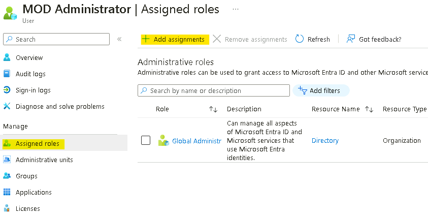
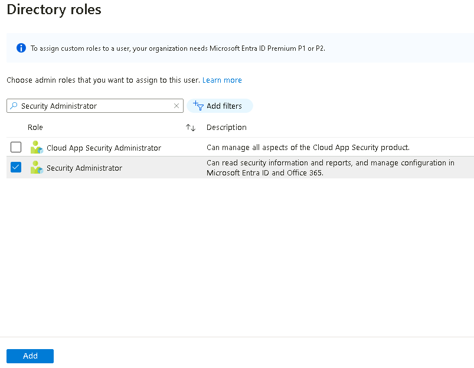
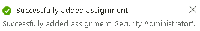
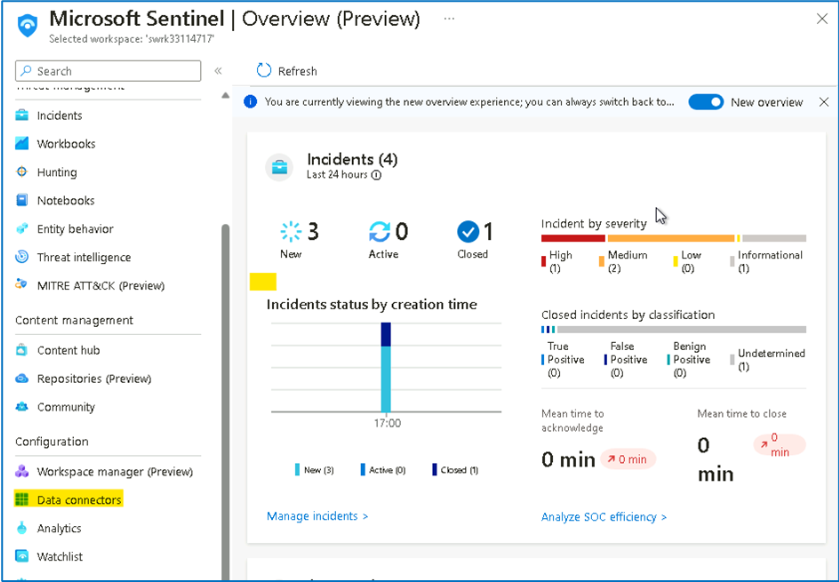
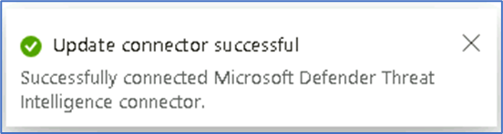

# Lab 2 \-- Enable Data Connectors in Microsoft Sentinel

## Objectives

In this Lab you will learn how to enable Data Connectors in Microsoft
Sentinel to bring alerts and/or telemetry from different sources.

Prerequisites

This lab assumes that you have completed Lab 1, as you will need an
Microsoft Sentinel workspace provisioned.

Some of the data connectors that will be used in this lab, require some
specific permissions on the workspace or your azure subscription. If you
don\'t have the appropriate permissions, you can still continue doing
the rest of the labs.

## Exercise 1 \-- Enabling Data Connectors in Microsoft Sentinel

### Task 1 - Enabling Azure Activity data connector

This exercise shows you how to enable Data connectors.

1.  In the browser tab navigate to
    <https://portal.azure.com/#view/Microsoft_AAD_UsersAndTenants/UserManagementMenuBlade/~/AllUsers>
    and select the Tenant Administrator account

    {width="6.268055555555556in"
    height="2.5027777777777778in"}

2.  Select the **Assigned roles** under Manage and then click on **+ Add
    assignments.**

    {width="6.268055555555556in"
    height="3.189583333333333in"}

3.  Search and select **Security Administrator**, then click on the
    **Add** button.

    {width="6.268055555555556in"
    height="4.863194444444445in"}

    {width="3.4692344706911635in"
    height="0.552159886264217in"}

4.  On the **Azure
    Portal** [**http://portal.azure.com**](urn:gd:lg:a:send-vm-keys),
    search for **Microsoft Sentinel** and click on **Microsoft
    Sentinel**.

{width="6.268055555555556in"
height="3.057638888888889in"}

1.  Select **SwrkXXXXXXX**.

{width="6.268055555555556in"
height="2.636111111111111in"}

2.  Now select **Data Connectors** under **Configuration** section.

{width="6.268055555555556in"
height="4.347916666666666in"}

3.  You should be able to see the **Data connectors** already available
    based on the selection made during the deployment.

{width="6.268055555555556in"
height="4.618055555555555in"}

4.  On the data connectors screen, select the **Azure
    Activity** connector and click on **Open connector page**.

{width="6.268055555555556in"
height="3.4006944444444445in"}

5.  On the **Azure Activity connector** page, go to option number **2.
    Connect your subscriptions through diagnostic settings new
    pipeline**. This method leverages Azure Policy and it brings many
    improvements compared to the old method (more details about these
    improvements can be found here). Click on the **Launch Azure Policy
    Assignment** wizard, this will redirect you to the policy creation
    page.

{width="6.268055555555556in"
height="3.4090277777777778in"}

6.  On the **Scope** selection select **Azure Pass \-- Sponsorship** and
    under **Resource Group** select **RG4Sentinel**. Click **Select**.

{width="6.268055555555556in"
height="3.6333333333333333in"}

7.  Go to the **Parameters** tab. On the **Primary Log Analytics
    workspace** select the **SwrkXXXXXXX**.

{width="6.268055555555556in"
height="5.3180555555555555in"}

8.  Under **Remediation** tab, select the check box besides **Create a
    remediation task** and then click on **Review + create** button

{width="6.268055555555556in"
height="4.336111111111111in"}

9.  On the **Review + create** tab, click on the **Create** button.

{width="6.268055555555556in"
height="5.085416666666666in"}

11. In the **Notification** pane you will be able to see the \'**Role
    Assignments creation succeeded**\', \'**Remediation task creation
    succeeded**\' and \'**Creating policy assignment succeeded**\'
    notifications.

{width="6.268055555555556in"
height="5.033333333333333in"}

12. On the **Azure Activity connector** page you will be able to see the
    connection status.

**Note**: It is normal if you don\'t immediately see the connector
showing as connected and in green, it takes around 30 minutes for the
process to complete. Also, each subscription has a maximum of 5
destinations for its activity logs. If this limit is already reached,
the policy created as part of this exercise won\'t be able to add an
additional destination to your Microsoft Sentinel workspace.

{width="6.268055555555556in"
height="3.411111111111111in"}

13. Continue to the next task then you can check back after 30 minutes.

14. Close the **Azure Activity** connector blade to go back to
    the **Data Connectors** page.

### Task 2 - Enabling Tenant-based Microsoft Defender for Cloud data connector

This task shows you how to enable the Microsoft Defender for Cloud data
connector. This connector allows you to stream your security alerts from
Microsoft Defender for Cloud into Microsoft Sentinel, so you can view
Defender data in workbooks, query it to produce alerts, and investigate
and respond to incidents.

1.  On the **Data connectors** screen, type **tenant** in the search
    bar, select the **Tenant-based Microsoft Defender for
    Cloud** **(Preview)** connector and click on **Open connector
    page**.

{width="6.268055555555556in"
height="4.107638888888889in"}

2.  On the **Tenant-based Microsoft Defender for
    Cloud** **(Preview)** connector page,
    under **Configuration** section click on the **Connect** button.

{width="6.268055555555556in"
height="3.484027777777778in"}

3.  You should receive the notification as Connected
    successfully. **\[If may be possible that the notification may not
    appear.\]{.underline}**

{width="6.268055555555556in"
height="5.0784722222222225in"}

4.  Wait for 3-5 minutes and then refresh the page, the Status of the
    connector should also be updated to **Connected.**

{width="6.268055555555556in"
height="3.486111111111111in"}

### Task 3 - Enabling Microsoft Defender Threat Intelligence connector

The **Microsoft Defender Threat Intelligence** (MDTI) connector to your
Sentinel workspace, which ingests Microsoft Threat Intelligence
indicators automatically into the ThreatIntelligenceIndicator table.
MDTI provides a set of indicators and access to
the https://ti.defender.microsoft.com portal at no additional cost, with
the premium features of the MDTI portal and API requiring licensing.

The *Threat Intelligence* content solution includes the data connectors
for all supported forms of Threat Intelligence.

**NOTE:** Sentinel also supports importing Threat Intelligence
indicators via the TAXII protocol using the **Threat Intelligence -
TAXII** data connector, so if you have your own preferred TI source, you
can add that to your workspace instead.

1.  On the **Azure
    Portal** [**http://portal.azure.com**](urn:gd:lg:a:send-vm-keys),
    search for **Microsoft Sentinel** and click on **Microsoft
    Sentinel**.

{width="6.268055555555556in"
height="3.061111111111111in"}

2.  Select **SwrkXXXXXXX**.

{width="6.268055555555556in"
height="2.6326388888888888in"}

3.  From the left menu choose the ***Microsoft Defender Threat
    Intelligence (preview)*** connector and click **Open Connector
    Page** at the bottom right.

{width="6.268055555555556in"
height="3.5444444444444443in"}

4.  On the Connector page, from the **Import indicators** list, leave
    the default \"**All available**\" selected, and click **Connect**.

{width="6.268055555555556in"
height="3.39375in"}

{width="5.75in"
height="1.5416666666666667in"}

5.  The Status of the Connector should be updated to **Connected.**

{width="6.268055555555556in"
height="3.5555555555555554in"}

6.  Threat Intelligence indicators will start being ingested into
    the **ThreatIntelligenceIndicator** table.
