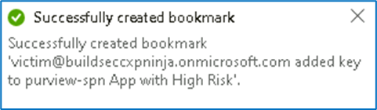

**Lab 4 \-- Hunting queries and Watchlists**

Objective

Our security researchers shared the following article describing
techniques used in the SolarWinds supply chain: [Identifying
UNC2452-Related Techniques for
ATT&CK ](https://medium.com/mitre-attack/identifying-unc2452-related-techniques-9f7b6c7f3714)

Based on the article, our SOC leads understand that to be able to see
the full picture of the attack campaign and spot anomalies on our data
set, we need to run a proactive threat hunt based on the MITRE tactics
and techniques described in this article.

Review the above article that highlights MITRE attack techniques and the
corresponding tools and methods. In this exercise, we will focus on
T1098. To get a greater understanding of this technique, review this
article: <https://attack.mitre.org/techniques/T1098/>

Prerequisites

This Lab assumes that you have completed Lab 1, as the data and the
artifacts that we will be using in this Lab need to be deployed on your
Microsoft Sentinel instance.

Exercise 1 \-- Overview of Hunting queries and Watchlist

Task 1 - Hunting on a specific MITRE technique

1.  On the Azure
    Portal [**http://portal.azure.com**](urn:gd:lg:a:send-vm-keys),
    search for [**Microsoft Sentinel**](urn:gd:lg:a:send-vm-keys) and
    click on **Microsoft Sentinel**.

{width="6.268055555555556in"
height="3.0909722222222222in"}

2.  Select **SwrkXXXXXXX**.

{width="6.268055555555556in"
height="2.6659722222222224in"}

3.  Now click on **Hunting** and then select the **Queries** tab.

{width="6.268055555555556in"
height="3.592361111111111in"}

4.  In the hunting page, we can see that **Microsoft Sentinel** provides
    built-in **hunting queries** to kick start the proactive hunting
    process.

{width="6.268055555555556in"
height="3.579861111111111in"}

5.  On the metric bar we can see statistics about how many queries are
    \"**active**\" and have the required data sources to run in your
    environment. There are also metrics showing how many **queries have
    been run** in during your current session, and how many of
    these **queries produced results**. We also see counts of the number
    of **Livestream results** and **bookmarks** created during the
    hunting process.

{width="6.268055555555556in"
height="3.5861111111111112in"}

6.  On the top action bar, shown in the above diagram, we can find
    the **Run All queries** button. Clicking on this button runs all
    active queries. This can take a significant amount of time depending
    on the number of queries and amount of log data being queried. To
    get results faster, it helps to **filter** down the set of queries
    to the specific set you need to run.

{width="6.268055555555556in"
height="3.6041666666666665in"}

7.  Microsoft Sentinel provides many different attributes to filter down
    to just the queries you want to run. To filter by **MITRE
    technique**, click **Add filter**, select **Techniques.**

{width="6.268055555555556in"
height="4.3180555555555555in"}

8.  In the **Techniques** value field, only
    select **T1098 \--** **Account Manipulation** and click **Apply**.

{width="6.268055555555556in"
height="4.74375in"}

{width="6.268055555555556in"
height="3.6395833333333334in"}

9.  Review all the queries in the table using this technique. In this
    phase we can multi-select all of queries run them as a batch. To do
    so, press on the multi-select checkboxes for the queries you want to
    run.

10. Select the filtered queries. Notice that the **Run All
    Queries** button has changed into the **Run selected
    queries** button. Click this button to run the queries.

**Note**: In some cases, you will need to modify the selected time range
based on the time you deploy the lab to get query results.

{width="6.268055555555556in"
height="4.138194444444444in"}

11. Once you have **Run selected queries**, the results start popping on
    the screen. In our case we immediately spot that the **Adding
    credentials to legitimate OAuth Applications** query returns several
    results.

{width="6.268055555555556in"
height="4.197916666666667in"}

12. Select this query and in the right pane press on **View query
    results**. This will navigate us to the log analytics screen to view
    the hunting query content and run it.

{width="6.268055555555556in"
height="3.6972222222222224in"}

13. On the **Logs** screen, once the hunting query finishes executing,
    we can see all the data that returned with the parsed fields and
    columns. From high overview we can see that we have the
    actor **IP** and the **username** that run this operation.

{width="6.268055555555556in"
height="3.173611111111111in"}

14. Expand one of the results and check the fields. As you can see, we
    are able to spot the Azure AD application name, the added key name
    and type the IP, username of the actor and other relevant
    information that help us understand the specific action.

{width="6.268055555555556in"
height="4.110416666666667in"}

Our SOC analysts needs to know which application from all the above
result set is critical and has a security risk. One way to do this is to
open Azure Active Directory for each application from the hunting
results, check their permissions, and validate the risk. Our SOC analyst
follows the organization knowledge base that guides him to review a list
for all the AAD applications with their risk levels.

Task 2 - Bookmarking hunting query results

While reviewing query results in Log Analytics, we use Microsoft
Sentinel\'s bookmarking feature to store and enrich these results. We
can extract entity identifiers and then use entity pages and the
investigation graph to investigate the entity. We can add tags and notes
to the results to say why it is interesting. Bookmarks will also
preserve the query and time range that generated the specific row result
so that analysts can reproduce the query in the future\
If as part of our investigation, we determine that the bookmarked query
result contains malicious activity, we can create a new incident from
the bookmark, or attach the bookmark to an existing incident.

1.  On the **Logs** screen, select the row using the checkbox on the
    left-hand side of the table. Click **Add bookmark** in the action
    menu just about the results table.

{width="6.268055555555556in"
height="3.192361111111111in"}

2.  On the right-hand bookmark pane modify the values as following.

-   **Bookmark
    Name** to **<victim@buildseccxpninja.onmicrosoft.com> added key to
    purview-spn App with High Risk**.

-   Using the drop down in the **entities** section of the **bookmark
    pane**, map the **Account** entity to
    the **InitiatingUserOrApp** column.

-   Map the **IP entity** to the **InitiatingIpAddress** column.

-   We will also add a tag to map it to the main attack story. In
    the **tags** section write, **\"solorwinds\"**

-   Click on **Create** at the bottom of the blade to create the
    bookmark.

{width="4.189192913385827in"
height="6.137898075240595in"}

{width="5.010416666666667in"
height="1.4583333333333333in"}

Task 3 - Create a watchlist

This task will show you how to use Microsoft Sentinel watchlists in
event correlation and enrichment. Once created, you can use watchlists
in your search, detection rules, threat hunting, and response playbooks.

1.  On the Azure
    Portal [**http://portal.azure.com**](urn:gd:lg:a:send-vm-keys),
    search for [**Microsoft Sentinel**](urn:gd:lg:a:send-vm-keys) and
    click on **Microsoft Sentinel**.

{width="6.268055555555556in"
height="3.066666666666667in"}

2.  Select **SwrkXXXXXXX**.

{width="6.268055555555556in"
height="2.640972222222222in"}

3.  Now click on **Watchlist** under Configurations, then click
    on **+** **New**.

{width="6.268055555555556in"
height="4.784722222222222in"}

4.  In the watchlist wizard enter the following and click ***Next:
    Source***:

    -   Name: **PenTestsIPaddresses**

    -   Description: [**IP addresses used during penetration
        tests**](urn:gd:lg:a:send-vm-keys)

    -   Watchlist Alias: **PenTestIPaddresses**

{width="6.268055555555556in"
height="3.63125in"}

5.  In the watchlist wizard, upload the
    file **C:\\Labfiles\\Lab4_IPAddresses.csv** from your desktop,
    under **SearchKey**, select **IPAddress**, review the **File
    Preview** and click **Next: Review and Create**.

{width="6.268055555555556in"
height="3.4368055555555554in"}

6.  On the Review + create tab, click on **Create** to finish the
    wizard.

{width="6.268055555555556in"
height="6.1125in"}

{width="5.364583333333333in"
height="1.6666666666666667in"}

7.  You should be back on the **Watchlist** page, click
    on **Refresh** button to view the newly created watchlist.

{width="6.268055555555556in"
height="5.457638888888889in"}

8.  The watchlist data takes about **3-5 minute** to be available in the
    workspace. Wait until the **Rows** number changes from 0 to 6. Then
    click on **View in Log Analytics**. It might take a few minutes to
    show up.

{width="6.268055555555556in"
height="4.048611111111111in"}

9.  On the Logs details, the Results should appear as shown in below
    image.

{width="6.268055555555556in"
height="3.3979166666666667in"}

10. We can run the below query to get all the defined watchlists.

[**\_GetWatchlistAlias**](urn:gd:lg:a:send-vm-keys)

{width="6.268055555555556in"
height="4.40625in"}

Congratulations, you have completed Lab 4!
