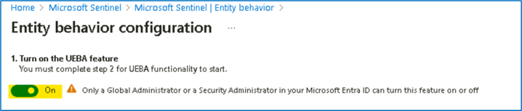
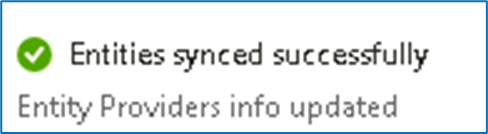
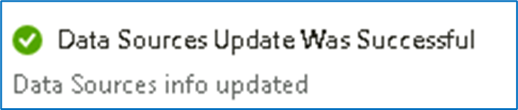
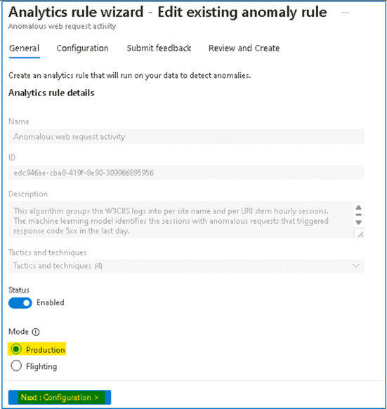
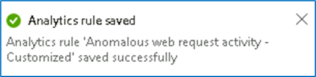
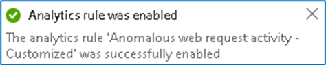

# Lab 6 - UEBA with Microsoft Sentinel

## Exercise 1: Explore UEBA with Microsoft Sentinel

{width="6.268055555555556in"
height="2.888888888888889in"}

You are a Security Operations Analyst working at a company that
implemented Microsoft Sentinel. Once you have connected your data
sources to Microsoft Sentinel, you can visualize and monitor the data
using the Microsoft Sentinel adoption of Azure Monitor Workbooks, which
provides versatility in creating custom dashboards.

Microsoft Sentinel allows you to create custom workbooks across your
data, and also comes with built-in workbook templates to allow you to
quickly gain insights across your data as soon as you connect a data
source.

### Task 1: Explore Entity Behavior

In this task, you will explore Entity behavior analytics in Microsoft
Sentinel.

1.  On the Azure
    Portal [**http://portal.azure.com**](urn:gd:lg:a:send-vm-keys),
    search for [**Microsoft Sentinel**](urn:gd:lg:a:send-vm-keys) and
    click on **Microsoft Sentinel**.

{width="6.268055555555556in"
height="3.066666666666667in"}

2.  Select **SwrkXXXXXXX**.

{width="6.268055555555556in"
height="2.6243055555555554in"}

3.  Now click on **Entity behavior** under Threat management.

{width="6.268055555555556in"
height="3.11875in"}

4.  On the popup from **Entity behavior settings**, select **Set UEBA**.

{width="6.268055555555556in"
height="3.332638888888889in"}

5.  On the next page, you should notice that **UEBA** is already enabled
    as a part of the Deployment done in Lab 1.

{width="6.268055555555556in"
height="1.3409722222222222in"}

**Note**: If UEBA is not On by default, turn it on from entity behavior
settings.

{width="6.268055555555556in"
height="4.383333333333334in"}

{width="6.268055555555556in"
height="5.114583333333333in"}

6.  For the section **2. Sync Microsoft Sentinel with at least one of
    the following directory services**, notice the Microsoft Entra ID is
    already selected, click on the **Apply** button.

{width="6.268055555555556in"
height="2.392361111111111in"}

{width="5.083333333333333in"
height="1.3958333333333333in"}

7.  You should receive the Notification as shown in below image. The
    page will automatically be redirected to the Entity behaviour page.

{width="6.0in" height="1.28125in"}

8.  The confirms that the Entity behaviour is configured successfully.

{width="6.268055555555556in"
height="3.4694444444444446in"}

### Task 2: Confirm and review Anomalies rules

In this task, we will confirm if Anomalies analytics rules are enabled.

1.  While on the Microsoft Sentinel page click on **Analytics** under
    configuration, then select the **Anomalies** tab.

{width="6.268055555555556in"
height="4.672916666666667in"}

2.  Select any rule and then select **Edit** on the rule blade.

{width="6.268055555555556in"
height="3.4791666666666665in"}

3.  Review the **General** tab information. Notice
    the **Mode** is **Production** and then select **Next:
    Configuration**.

{width="5.741903980752406in"
height="6.075371828521435in"}

4.  Review the ***Configuration*** tab information. Notice that you
    cannot change the **Anomaly score threshold**.

{width="6.242106299212598in"
height="6.117055993000875in"}

5.  Then select **X** in the top right corner to exit the Analytics rule
    wizard.

6.  Scroll right to the analytics rule you selected until see and select
    the ellipsis **(\...)** icon. Select **Duplicate**

{width="6.268055555555556in"
height="2.946527777777778in"}

7.  Scroll left to review the new rule with the **FLGT** tab at the
    beginning of the name. Select **FLGT** rule and then
    select **Edit** on the rule blade.

{width="6.268055555555556in"
height="2.4902777777777776in"}

8.  Review the **General** tab information. Set the status
    to **Enabled**, you will notice the **Mode** is **Flighting** and
    then select **Next: Configuration**.

{width="5.658536745406824in"
height="6.117055993000875in"}

9.  Review the **Configuration** tab information. Notice that you can
    now change the **Anomaly score threshold**.

{width="6.268055555555556in"
height="4.91875in"}

10. Set the value to **1** and then select **Next: Submit Feedback**.

{width="6.158739063867016in"
height="6.106634951881015in"}

11. Provide the feedback and then click on **Next: Review + create**.

{width="6.268055555555556in"
height="6.072222222222222in"}

12. After the Validation is completed, click on Save button to update
    the rule

{width="6.268055555555556in"
height="3.540277777777778in"}

{width="5.541666666666667in"
height="1.3645833333333333in"}

13. If the **FLGT Analytic rule** still shows **Disabled**, then
    right-click on it and select **Enable** option.

{width="6.268055555555556in"
height="3.2041666666666666in"}

{width="4.9375in"
height="0.9895833333333334in"}

14. Now it should be enabled.

{width="6.268055555555556in"
height="2.1770833333333335in"}
