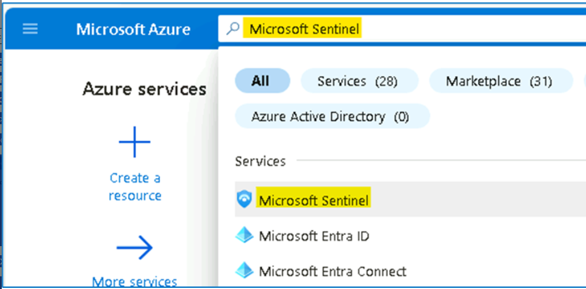
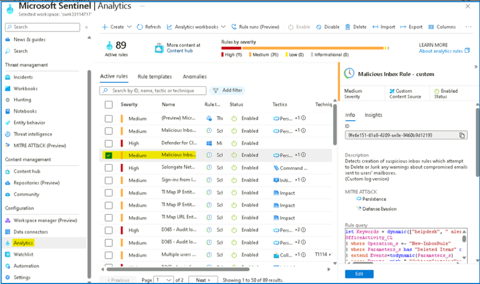
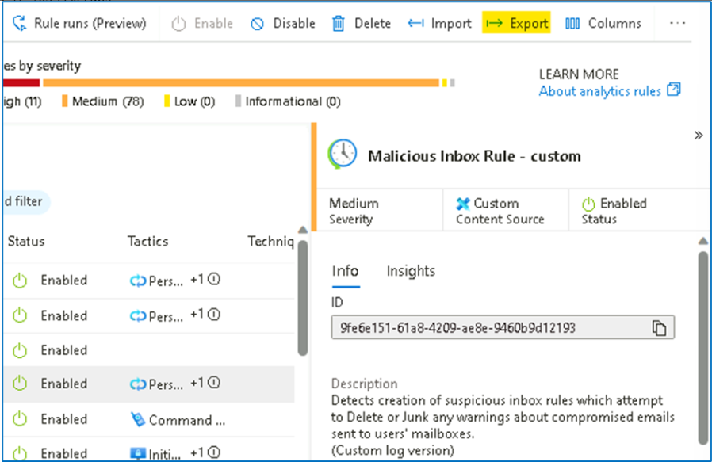

# Lab 8 - Repositories in Microsoft Sentinel

## Exercise 1: Explore Repositories in Microsoft Sentinel

### Task 1: Creating and exporting an analytical rule

In this task, you will enable Entity behaviour analytics in Microsoft
Sentinel.

1.  On the Azure
    Portal [**http://portal.azure.com**](urn:gd:lg:a:send-vm-keys),
    search for [**Microsoft Sentinel**](urn:gd:lg:a:send-vm-keys) and
    click on **Microsoft Sentinel**.

{width="6.268055555555556in" height="3.1in"}

2.  Select **SwrkXXXXXXX**.

{width="6.268055555555556in"
height="2.652083333333333in"}

3.  Now click on **Analytics** under the **Configuration** area from the
    left blade. Select the **Malicious Inbox Rule** that you created
    earlier.

{width="6.268055555555556in"
height="3.7159722222222222in"}

4.  Select the **Export** from the toolbar. **Hint:** You might need to
    select the ellipsis icon **(\...)** to see it.

{width="6.268055555555556in"
height="4.069444444444445in"}

5.  The rule is exported to a text file
    named **Azure_Sentinel_analytic_rule.json**. Select **Open
    file** below the name of the downloaded file.

{width="6.268055555555556in"
height="1.7090277777777778in"}

6.  Select **More apps** and then select **Notepad** and then
    select **OK**.

{width="6.042509842519685in"
height="6.094600831146106in"}

7.  Review the **Azure Resource Manager** template and the close it when
    done.

{width="6.268055555555556in"
height="4.263888888888889in"}

### Task 2: Creating our Azure DevOps environment

In this task, you will create an Azure DevOps repository.

1.  Open another tab in the browser and navigate
    to [**https://aexprodcus1.vsaex.visualstudio.com/me?mkt=en-US**](urn:gd:lg:a:send-vm-keys)

2.  On the **We need a few more details** page, select **Continue**.

{width="6.268055555555556in"
height="4.75625in"}

3.  On the **Get started with Azure DevOps** page, select **Create new
    organization** and then select **Continue**.

{width="6.268055555555556in"
height="3.6694444444444443in"}

{width="6.268055555555556in"
height="4.90625in"}

4.  On the **Almost done\...** page, enter a name for your DevOps
    organization that you would not want to use in the future, like for
    example, your tenant suffix \[number at the end of **m365x**\].
    Under **We\'ll host your projects in**, select **United States**.
    Enter characters you see, then **Continue**.

{width="4.156829615048119in"
height="5.698711723534558in"}

{width="6.268055555555556in"
height="4.136111111111111in"}

5.  On the **Create a project to get started** page, enter **My Sentinel
    Content** and then select **Create project**.

{width="6.268055555555556in"
height="4.715277777777778in"}

6.  Navigate to **Repos** on the left pane. At the bottom of the page in
    the area **Initialize main branch with a README or gitignore**,
    select **Initialize**.

{width="6.268055555555556in"
height="3.838888888888889in"}

7.  The page should show the Files for the Repo. The only file is
    README.md. On the Files (right side of the page) blade, the toolbar
    include options *Set up build*, *Clone*, \... Select the colon
    icon **(:)** to show more options. Select **Upload Files**.

{width="6.268055555555556in"
height="3.575in"}

8.  Select **Browse** and select the
    file **Azure_Sentinel_analytic_rule.json** from
    your **Downloads** directory. Select **Commit**.

{width="6.268055555555556in"
height="5.9430555555555555in"}

9.  Select **Azure DevOps** on the top left corner of the page. This
    display your organization and projects. Select **Organization
    settings** from the bottom left of the page.

{width="6.268055555555556in"
height="5.9527777777777775in"}

10. Select **Policies** under the **Security** area of the left blade.
    Toggle **On** **Third-party application access via OAuth** under
    the **Application connection policies** area.

{width="6.268055555555556in"
height="4.05in"}

### Task 3: Connecting Sentinel to Azure DevOps.

1.  On the Azure
    Portal [**http://portal.azure.com**](urn:gd:lg:a:send-vm-keys) and
    search for **Microsoft Sentinel** and click on **Microsoft
    Sentinel**.

{width="6.268055555555556in"
height="3.0972222222222223in"}

2.  Select **SwrkXXXXXXX**.

{width="6.268055555555556in"
height="2.6458333333333335in"}

3.  Now click on **Repositories (Preview)** in the **Content
    Management** section.

{width="6.268055555555556in"
height="3.2194444444444446in"}

4.  Select **+ Add new** button from the toolbar.

{width="6.268055555555556in"
height="3.3875in"}

5.  For the name enter [**My Content**](urn:gd:lg:a:send-vm-keys). For
    Source control, select **Azure DevOps**. Select **Authorize**.

{width="6.268055555555556in"
height="2.365972222222222in"}

6.  On the **Azure Sentinel V3 (Prod) by Microsoft** page scroll down
    the permissions request and then select **Accept**.

{width="6.268055555555556in"
height="4.480555555555555in"}

7.  Select the **Organization** your created earlier. Select the Project
    you created earlier, **My Sentinel Content**. Select the Repository
    you created earlier, **My Sentinel Content**. Select the
    Branch **main**. Select all content types. Then select **Create**.

{width="6.268055555555556in"
height="5.086111111111111in"}

8.  The Connection creation error can occur, close the page and return
    back to Repositories (Preview) page.

{width="6.268055555555556in"
height="1.6527777777777777in"}

9.  On the **Repositories** *(Preview)* page, select **Refresh**.
    Wait **until *Last* deployment status** is **Failed**.

{width="6.268055555555556in"
height="2.734722222222222in"}

{width="6.268055555555556in"
height="2.571527777777778in"}

**Note**: The Failed status is due to limitations in the hosted lab
environment. You would normally see Succeeded. Then you can see in the
Analytics the imported rule Rule from Azure DevOps.

**Congratulation** you have completed Lab 8. In this lab, we had
explored the advanced features of Microsoft Sentinel.
